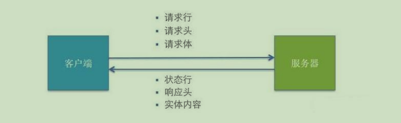

# HTTP相关

## HTTP 请求交互的基本过程

前台应用从浏览器端向服务器发送 `HTTP` 请求（请求报文）。

后台服务器接收到请求后，调度服务器应用处理请求，向浏览器端返回 `HTTP` 响应（响应报文）。

浏览器端接收到响应，解析显示响应体/调用监视回调。



## HTTP 请求报文

- 请求行：`method`、`url`。

```bash
GET /user?id=1
POST /login
```

- 请求头（多个）：`headers`。

```bash
Host: www.baidu.com
Cookie: BAIDUID=AD3B0FA706E; BIDUPSID=AD3B0FA706
Content-Type: application/x-www-form-urlencoded
# 或者
Content-Type: application/json
# ...
```

- 请求体：`body`。

```bash
username=wll&pwd=123

{
  "username": "wll",
  "pwd": 123
}
```

## HTTP 响应报文

响应状态行（状态码）：`status statusText`。

- 200 --> OK --> 请求成功，一般用于 GET 与 POST 请求。

- 201 --> Created --> 已创建，成功请求并创建了新的资源。

- 401 --> Unauthorized --> 未授权/请求要求用户的身份认证。

- 404 --> Not Found --> 服务器无法根据客户端的请求找到资源。

- 500 --> Internal Server Error --> 服务器内部错误，无法完成请求。

响应头（多个）：

```bash
Content-Type: text/html;charset=utf-8
Set-Cookie: BD_CK_SAM=1;path=/
# ...
```

响应体：html 文本、json 文本、js、css、图片。。。

## POST 请求体参数格式

- `COntent-Type: application/x-www-form-urlencoded;charset=utf-8`：用于键值对参数，参数的健值用 `=` 连接，参数之间用 `&` 连接。

```js
name=xxx&age=18
```

- `Content-Type: application/json;charset=utf-8`：用于 `json` 字符串参数。

```json
{
  "name": "xxx",
  "age": 18
}
```

- `Content-Type: multipart/form-data`：用于文件上传请求。
