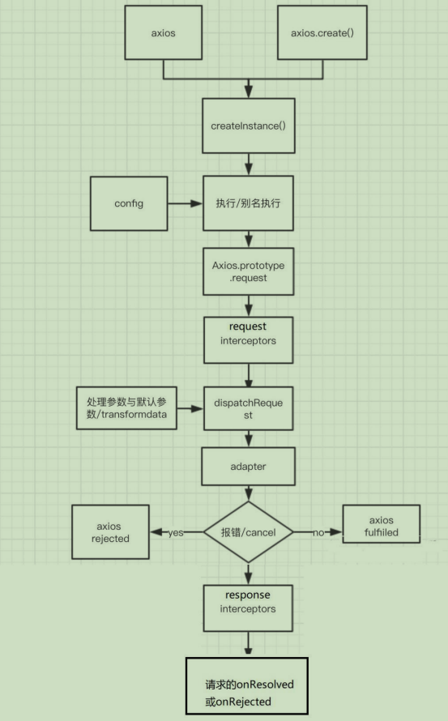
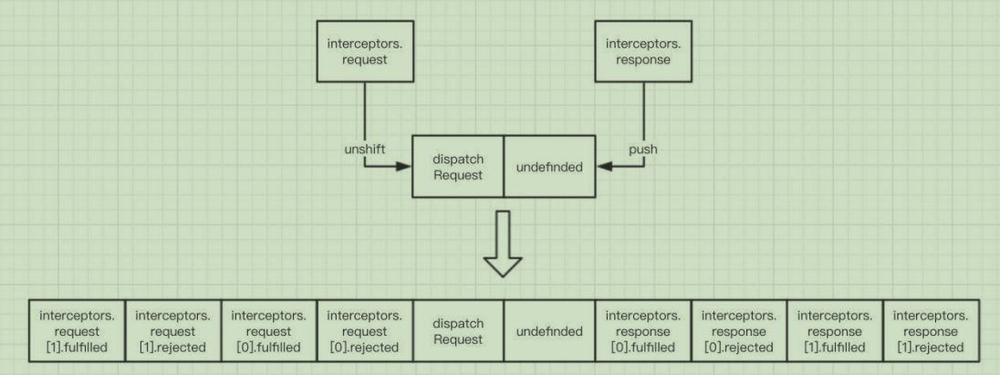

# axios源码分析

## 源码目录结构

```bash
├── /dist/                     # 项目输出目录
├── /lib/                      # 项目源码目录
│ ├── /adapters/               # 定义请求的适配器 xhr、http
│ │ ├── http.js                # 实现http适配器(包装http包)
│ │ └── xhr.js                 # 实现xhr适配器(包装xhr对象)
│ ├── /cancel/                 # 定义取消功能
│ ├── /core/                   # 一些核心功能
│ │ ├── Axios.js               # axios的核心主类
│ │ ├── dispatchRequest.js     # 用来调用http请求适配器方法发送请求的函数
│ │ ├── InterceptorManager.js  # 拦截器的管理器
│ │ └── settle.js              # 根据http响应状态，改变Promise的状态
│ ├── /helpers/                # 一些辅助方法
│ ├── axios.js                 # 对外暴露接口
│ ├── defaults.js              # axios的默认配置
│ └── utils.js                 # 公用工具
├── package.json               # 项目信息
├── index.d.ts                 # 配置TypeScript的声明文件
└── index.js                   # 入口文件
```

## axios 与 Axios 的关系

从语法上来说：`axios` 不是 `Axios` 的实例。

从功能上来说：`axios` 是 `Axios` 的实例。

`axios` 是 `Axios.prototype.request` 函数 `bind(Axios 的实例)` 返回的函数。

`axios` 作为对象，有 `Axios` 原型对象上的所有方法（`get()`、`post()`、`put()`、`delete()`），也有 `Axios` 对象上的所有属性（`defaults`、`interceptors`），后面又添加了 `create()`、`CancelToken()`、`all()`。

## axios.create() 与 axios 的区别

相同点：

- 都是一个能发任意请求的函数：`request(config)`。

- 都有发特定请求的各种方法：`get()`、`post()`、`put()`、`delete()`。

- 都有默认配置和拦截器得到属性：`defaults`、`interceptors`。

不同点：

- 默认匹配的值很可能不一样。

- `axios.create()` 创建出来的实例没有 `axios` 后面添加的一些方法：`create()`、`CancelToken()`、`all()`。

## axios 运行的整体流程

整体流程：`request(config)` --> `dispatchRequest(config)` --> `xhrAdapter(config)`。

`request(config)`：将请求拦截器 --> dispatchRequest() --> 响应拦截器通过 `Promise` 链串联起来，返回 `Promise`。

`dispatchRequest(config)`：转换请求数据 --> 调用 xhrAdapter() 发请求 --> 请求返回后转换响应数据，返回 `Promise`。

`xhrAdapter(config)`：创建 XHR 对象，根据 config 进行相应设置，发送特定请求，并接收响应数据，返回 `Promise`。



**request 串联整个流程图**



## axios 拦截器

请求拦截器：

- 在真正发送请求前执行的回调函数。

- 可以对请求进行检查或配置进行特定处理。

- 成功的回调函数，传递的必须是 `config`。

- 失败的回调函数，传递的默认是 `error`。

响应拦截器：

- 在请求得到响应后执行的回调函数。

- 可以对响应数据进行特定处理。

- 成功的回调函数，传递的默认是 `response`。

- 失败的回调函数，传递的默认是 `error`。
