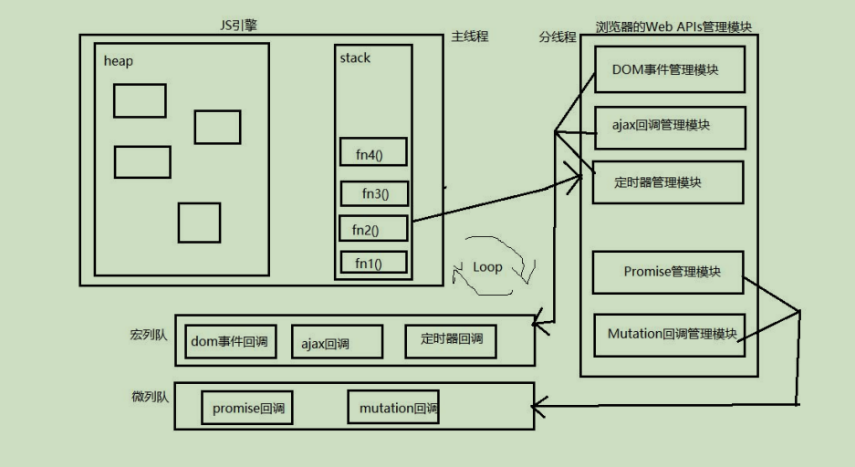

# 宏队列与微队列

js 中用来存储待执行回调函数的队列包含 2 个不同特点的队列。

- `宏队列`：用来保存待执行的宏任务回调。  
比如：定时器回调、DOM 事件回调、ajax 回调。

- `微队列`：用来保存待执行的微任务回调。  
比如：Promise 的回调（then/catch）、MutationObserver 的回调。

js 执行时会区分这 2 个队列。

- js 引擎首先必须先执行所有的初始化同步任务代码。

- 每次准备取出第一个宏任务执行前，都要将所有的微任务一个一个取出来执行。

- 当前微队列中的微任务全部执行完毕才会执行宏任务。
