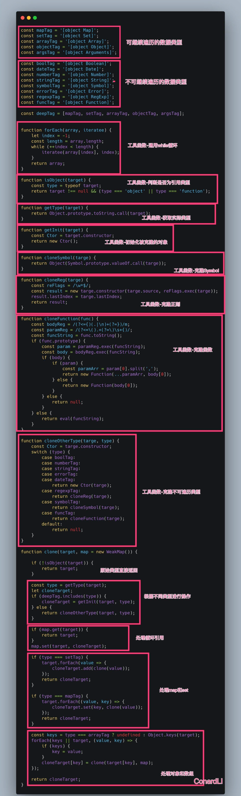

# 深拷贝

理解深拷贝之前我们必须了解数据类型。

数据类型分为基本数据类型和引用数据类型。

- 基本数据类型：存储的是实际的数据（String、Number、Boolean、Null、Undefined）。

- 引用数据类型：存储的是该对象数据在栈中的引用（地址值），真实的数据存放在堆内存里。

## 拷贝数据

基本数据类型存放的就是实际的数据，可以直接拷贝。

```js
let a = 1
let b = a
b // 1
a // 1
b = 2
b // 2
a // 1
```

对象数据存放的是对象在栈内存的引用，直接拷贝的是对象的引用。

```js
let a = { name: '孙悟空' }
let b = a // b 复制了 a 在栈内存的引用
b.name = '猪八戒'
a // { name: '猪八戒' }
```

### 常用的拷贝方法

- `Array.prototype.concat(...valueN)`：合并两个或多个数组。此方法不会更改现有数组，而是返回一个新数组。

```js
let arr1 = [1, 2, 3]
let arr2 = arr1.concat()
arr2 // [1, 2, 3]
arr2[0] = 100
arr1 // [1, 2, 3]
```

- `Array.prototype.slice(begin, end)`：返回一个新的数组对象，这一对象是一个由 `begin` 和 `end` 决定的原数组的浅拷贝（包括 begin，不包括 end）。原始数组不会被改变。

```js
let arr1 = [1, 2, 3]
let arr2 = arr1.slice()
arr2 // [1, 2, 3]
arr2[0] = 100
arr1 // [1, 2, 3]
```

- `Object.assign(target, ...sources)`：用于将所有可枚举属性的值从一个或多个源对象分配到目标对象。它将返回目标对象。

```js
let obj1 = { name: '孙悟空' }
let obj2 = Object.assign({}, obj1)
obj2 // { name: '孙悟空' }
obj2.name = '猪八戒' // 猪八戒
obj1 // { name: '孙悟空' }
```

以上三个方法，当数组或对象只有一个层次的时候可以看做是深拷贝，存在多个层次就是浅拷贝了。

```js
// Array.prototype.concat
let arr1 = [[1], 2, 3]
let arr2 = arr1.concat()
arr2 // [[1], 2, 3]
arr2[0][0] = 100
arr1 // [[100], 2, 3]

// Array.prototype.slice
let arr1 = [[1], 2, 3]
let arr2 = arr1.slice()
arr2 // [[1], 2, 3]
arr2[0][0] = 100
arr1 // [[100], 2, 3]

// Object.assign
let obj1 = { name: { name: '孙悟空' } }
let obj2 = Object.assign({}, obj1)
obj2 // { name: { name: '孙悟空' } }
obj2.name.name = '猪八戒'
obj1 // { name: { name: '猪八戒' } }
```

- `JSON.parse(JSON.stringify(value))`：通过 JSON 转换进行深拷贝，但不能处理函数数据和 undefined 数据。

```js
let arr1 = [[1], 2, 3]
let arr2 = JSON.parse(JSON.stringify(arr1))
arr2 // [[1], 2, 3]
arr2[0][0] = 100
arr1 // [[1], 2, 3]

let obj1 = { name: { name: '孙悟空' } }
let obj2 = JSON.parse(JSON.stringify(obj1))
obj2 // { name: { name: '孙悟空' } }
obj2.name.name = '猪八戒'
obj1 // { name: { name: '孙悟空' } }
```

## 实现深拷贝（不适用循环引用）

```js
// 获取类型
function getType(obj) {
  return Object.prototype.toString.call(obj).slice(8, -1)
}

// 深度拷贝
function deepClone(obj) {
  let result, objType = getType(obj)
  switch(objType) {
    case 'Object':
      result = {}
      break
    case 'Array':
      result = []
      break
    default:
      return obj // 如果是其他数据类型，则直接将数据返回
  }
  // 遍历目标对象
  for(let k in obj) {
    let value = obj[k]
    result[k] = deepClone(value) // 递归解决多层次问题
  }
  return result
}

let arr1 = [[1], 2, 3]
let arr2 = deepClone(arr1)
arr2 // [[1], 2, 3]
arr2[0][0] = 100
arr1 // [[1], 2, 3]
```

**完整深拷贝**


