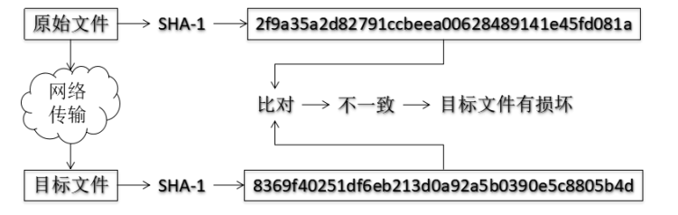
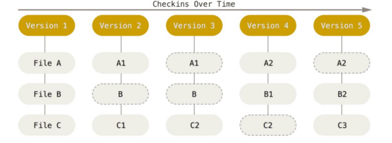

# git基本原理

## 哈希

**明文 --> 加密算法 --> 密文。**

哈希是一个系列的加密算法，各个不同的哈希算法虽然加密强度不同，但是有以下几个共同点。

- 不管输入数据的数据量有多大，输入同一个哈希算法，得到的加密结果长度固定。

- 哈希算法确定，输入数据确定，输出数据能够保证不变。

- 哈希算法确定，输入数据有变化，输出数据一定有变化，而且通常变化很大。

- 哈希算法不可逆。

**git 底层采用的是 SHA-1 算法。**

## 哈希算法验证文件

`git` 就是靠这种机制来从根本上保证数据完整性的。

## git 的文件管理机制

`git` 把数据看作是小型文件系统的一组快照。

每次提交更新时 `git` 都会对当前的全部文件制作一个快照并保存整个快照的索引。

为了高效，如果文件没有修改，`git` 不再重新存储该文件，而是只保留一个链接指向之前存储的文件。

所以 `git` 的工作方式可以称之为快照流。

