# canvas画布

## canvas画布的宽度与高度

`canvas` 标签只有两个常用的标签属性：width 和 height。

当没有设置宽度和高度的时候，`canvas` 会初始化成宽300px，高150px的画布。

使用 html 属性设置 width，height 时，只影响画布本身，不影响画布内容。

通过 css 样式指定 `canvas` 的 width，height 时，不但影响画布本身的宽高，还会使画布中的内容等比例缩放（缩放参照画布默认的尺寸）。

```html
<!-- 不要通过样式指定宽高 -->
<canvas id="canvas" width="400" height="200" style="border: 1px solid"></canvas>
```

## canvas画笔

`canvas` 标签身上有一个 getContext() 方法。

这个方法是用来获取渲染上下文和它绘画的功能。

```js
const canvas = document.getElementById('canvas')

// 检查浏览器是否支持canvas
if (canvas.getContext) {
  // canvas相关的操作基本都在ctx上面进行
  const ctx = canvas.getContext('2d')
}
```

## canvas绘制矩形

`canvas` 标签只支持一种原生的图像绘制，那就是矩形。

其他图像的绘制至少都需要生成一条路径（后续会介绍路径）。

矩形包含 fillRect（填充矩形）和 strokeRect （边框矩形）两种，这两种绘制矩形的方法不会生成路径。

ctx.fillRect(x, y, width, height)

ctx.strokeRect(x, y, width, height)

两种矩形的参数都是一样的：

1. x：x轴偏移量。
2. y：y轴偏移量。
3. width：矩形宽度。
4. height：矩形高度。

注意：画布左上方 x 轴，y 轴的偏移量为 (0, 0)，所以这里可以看作为原点。

```js
// 填充矩形
ctx.fillRect(50, 50, 100, 100)

// 边框矩形
ctx.strokeRect(200, 50, 100, 100)
```

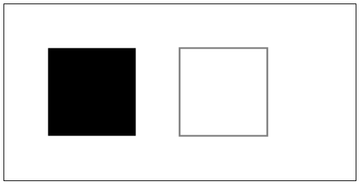

### strokeRect边框矩形渲染问题

按理来说，strokeRect 渲染时的默认边框应该是 1px。

但是 `canvas` 在渲染矩形边框时，边框宽度是平均分在偏移位置两侧的。

举例说明：

```js
// 边框会渲染在 49.5-50.5 之间，浏览器是不会让一个像素只显示一半的，只会全部显示。相当于边框会渲染在 49-51 之间，也就是 2px
ctx.strokeRect(50, 50, 100, 100)

// 将偏移量多移动 0.5，边框会渲染在 200-201 和 50-51 之间，也就是1px
ctx.strokeRect(200.5, 50.5, 100, 100)
```

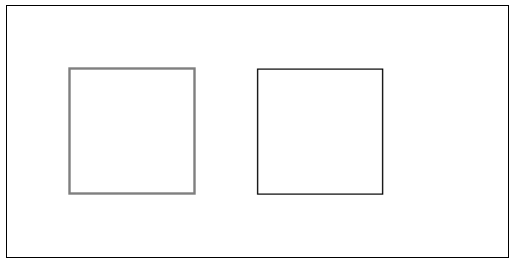

## canvas清除区域

ctx.clearRect(x, y, width, height)：可以清除 `canvas` 画布上指定的区域，让清除部分完全透明。

```js
ctx.fillRect(50, 50, 100, 100)

// 以 (100, 100) 为偏移量，清除一个 50 * 50 的区域
ctx.clearRect(100, 100, 50, 50)
```

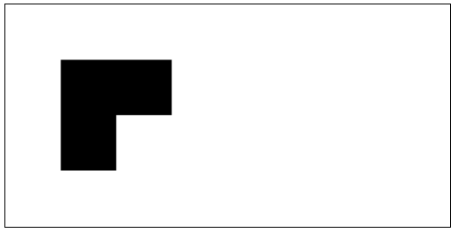

## canvas样式和颜色

在绘制图像之前，我们可以先设置图像的样式或者颜色。

ctx.fillStyle：设置图像的填充颜色。（默认黑色）

ctx.strokeStyle：设置图像轮廓的颜色。（默认黑色）

ctx.lineWidth：设置当前绘线的粗细，属性值必须为正数（默认值 1，0、负数、Infinity 和 NaN 会被忽略）。

ctx.lineJoin：设定线条与线条间结合的样式。（默认miter）

1. round：圆角。
2. bevel：斜角。
3. miter：直角。

```js
// 填充样式红色
ctx.fillStyle = 'red'

// 边框样式蓝色
ctx.strokeStyle = 'blue'

// 绘线粗细 10px
ctx.lineWidth = 10

// 绘线交接呈现圆角
ctx.lineJoin = 'round'
ctx.fillRect(50, 50, 100, 100)
ctx.strokeRect(200, 50, 100, 100)
```

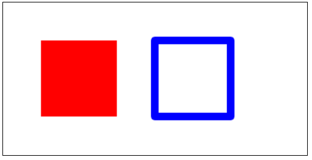

## canvas路径

### 路径绘制矩形

ctx.stroke()：通过线条来绘制图像轮廓，不会自动调用 closePath()。

ctx.fill()：通过填充路径的内容区域生成实心的图像，自动调用closePath()。

ctx.rect(x, y, width, height)：绘制一个偏移量 (x, y)，宽 width，高 height 的矩形。

- 当该方法执行的时候，moveTo() 方法自动设置起点坐标为 (x, y)。

- 该方法执行完毕的时候，画布上不会呈现图像，相当于只是形成了路径列表，要调用 fill() 或 stroke() 方法才会呈现在画布中。

```js
// 绘制路径不显示
ctx.rect(50, 50, 100, 100)
// 填充显示
ctx.fill()

ctx.rect(200, 50, 100, 100)
// 路径连接显示
ctx.stroke()
```

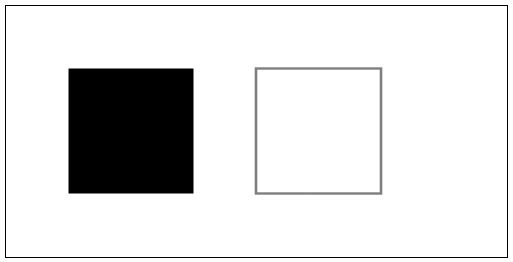

### 重置路径和闭合路径

ctx.beginPath()：新建一条路径，生成之后，图像绘制命令被指向到路径上准备生成路径。

- 本质上，路径是由多个子路径构成，这些子路径都是在一个路径列表中，每次调用 beginPath，路径列表都会清空重置。

- 通常我们在绘制图像之前，都会调用该方法。

ctx.moveTo(x, y)：将画笔移动到指定的坐标轴上。（设置起点）

ctx.lineTo(x, y)：绘制一条从当前位置到指定坐标轴位置的直线。

ctx.closePath()：闭合路径，图像绘制命令又重新指向到上下文中。

- 使用 fill() 绘制图像或图像路径已经闭合不需要使用此方法。

- 通常使用 stroke() 绘制图像的时候才使用此方法。

```js
// 自动填充路径
ctx.beginPath()
ctx.moveTo(50, 50)
ctx.lineTo(100, 50)
ctx.lineTo(100, 100)
ctx.fill()

// 路径不会自动闭合
ctx.beginPath()
ctx.moveTo(150, 50)
ctx.lineTo(200, 50)
ctx.lineTo(200, 100)
ctx.stroke()

// 手动闭合路径
ctx.beginPath()
ctx.moveTo(250, 50)
ctx.lineTo(300, 50)
ctx.lineTo(300, 100)
ctx.closePath()
ctx.stroke()
```

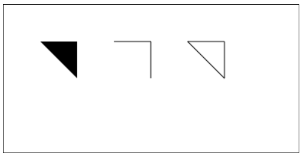

### 路径绘线样式

ctx.lineCap：绘制每一条线段末端的样式属性。

1. butt：线段末端以方形结束。（默认值）
2. round：线段末端以圆形结束。
3. square：线段末端以方形结束，但是增加了一个宽度和线段相同，高度是线段宽度一半的矩形区域。

```js
// 绘线末端圆形显示
ctx.lineCap = 'round'
ctx.lineWidth = 10
ctx.moveTo(50, 50)
ctx.lineTo(100, 50)
ctx.lineTo(100, 100)
ctx.stroke()
```

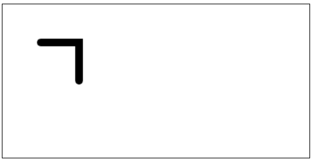

## canvas状态

ctx.save()：将当前状态放入栈中，保持 `canvas` 全部状态的方法。

保存到栈中的绘制状态由下面部分组成。

1. 当前的变换矩阵。
2. 当前的剪切区域。
3. 当前的虚线列表。
4. 绘制图像的样式（strokeStyle / fillStyle / lineWidth / lineJoin / lineCap ...）。

ctx.restore()：通过在绘图状态栈中弹出顶端的状态，将 `canvas` 恢复到最近的保存状态的方法，如果没有保存状态，此方法不做任何改变。

通常我们在绘制图像进行的操作，都会放在 save() 和 restore() 方法之间，避免当前绘制图像设置的状态，影响到后续图像的绘制效果。

```js
// 画布默认状态放入栈中
ctx.save()
// 当前填充样式设置为红色
ctx.fillStyle = 'red'
// 绘制矩形，显示效果为红色
ctx.fillRect(50, 50, 100, 100)
// 弹出栈中顶端状态，这个时候红色的填充样式会被弹出的状态覆盖，变为黑色
ctx.restore()
// 绘制矩形，显示效果为黑色
ctx.fillRect(200, 50, 100, 100)
```

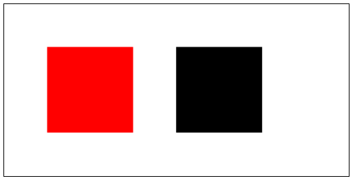

## canvas圆形 / 圆弧

ctx.arc(x, y, radius, startAngle, endAngle, anticlockwise)：画一个以(x, y)坐标为圆心，radius 为半径的圆弧或圆，从 startAngle 开始，到 endAngle 结束。

参数如下：

1. x：圆心在画布 x 轴上的偏移量。
2. y：圆心在画布 y 轴上的偏移量。
3. radius：绘制圆的半径。
4. startAngle：圆弧的起始点，x 轴方向开始计算，单位以弧度表示。
5. endAngle：圆弧的终点，单位以弧度表示。
6. anticlockwise：布尔值。true 表示逆时针，false 表示顺时针。（默认值）

```js
// 绘制一个在(100, 100)坐标为圆心，半径50的圆
ctx.arc(100, 100, 50, 0, 2 * Math.PI, false)
// 绘制边框圆形
ctx.stroke()
```

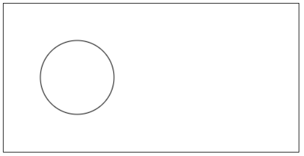

ctx.arcTo(x1, y1, x2, y2, radius)：根据设置的两个控制点和半径画一段圆弧。

注意：

- 必须存在一个开始坐标点 ctx.moveTo(x, y)，三点才能构成圆弧，半径为 radius 的圆向夹角里面填充。

- 绘制的圆弧一定经过起点，但不一定经过 (x1, y1) 和 (x2, y2)，这两个坐标只是用来控制方向的。

```js
// 将3个点连接起来
ctx.beginPath()
ctx.moveTo(20, 20)
ctx.lineTo(200, 0)
ctx.lineTo(100, 100)
ctx.stroke()

// 观察圆弧在3点之间的位置
ctx.beginPath()
ctx.moveTo(20, 20)
ctx.arcTo(200, 0, 100, 100, 20)
ctx.stroke()
```

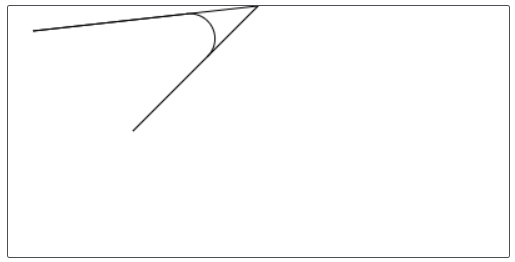

## canvas贝塞尔曲线

### 二次贝塞尔

ctx.quadraticCurveTo(cpx, cpy, x, y)：绘制二次贝塞尔曲线。

参数：

1. cpx：控制点的 x 轴坐标。
2. cpy：控制点的 y 轴坐标。
3. x：终点的 x 轴坐标。
4. y：终点的 y 轴坐标。

注意：

- 必须要设置起点 moveTo(x, y)。

- 二次贝塞尔曲线一定经过起点和终点。

```js
// 将3个点连接起来
ctx.beginPath()
ctx.moveTo(20, 20)
ctx.lineTo(200, 0)
ctx.lineTo(100, 100)
ctx.stroke()

// 观察二次贝塞尔曲线在3点之间的位置
ctx.beginPath()
ctx.moveTo(20, 20)
ctx.quadraticCurveTo(200, 0, 100, 100, 20)
ctx.stroke()
```

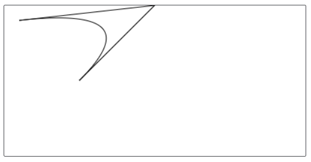

### 三次贝塞尔

ctx.bezierCurveTo(cp1x, cp1y, cp2x, cp2y, x, y)：绘制三次贝塞尔曲线。

参数只是在二次贝塞尔的基础上多增加了一个控制点 (cp2x, cp2y)。

同样要设置起点 moveTo(x, y)，也一定经过起点和终点。

```js
// 将4个点连接起来
ctx.beginPath()
ctx.moveTo(20, 20)
ctx.lineTo(200, 0)
ctx.lineTo(100, 100)
ctx.lineTo(200, 100)
ctx.stroke()

// 观察三次贝塞尔曲线在4点之间的位置
ctx.beginPath()
ctx.moveTo(20, 20)
ctx.bezierCurveTo(200, 0, 100, 100, 200, 100, 20)
ctx.stroke()
```

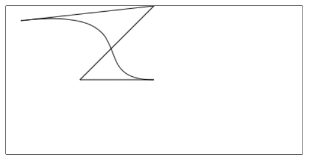

## canvas变换

### 平移变换

ctx.translate(x, y)：对当前 `canvas` 画布进行平移变换。

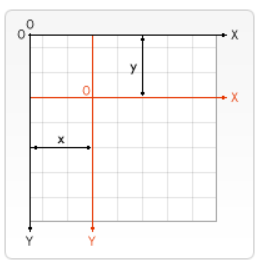

参数：

1. x：水平方向的移动距离。
2. y：垂直方向的移动距离。

注意：在 `canvas` 中 translate 是累加的。

```js
// x 轴和 y 轴都平移 50px
ctx.translate(50, 50)
ctx.fillRect(0, 0, 100, 100)
```

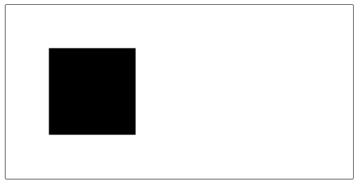

### 旋转变换

ctx.rotate(angle)：将当前 `canvas` 画布对照原点顺时针旋转。

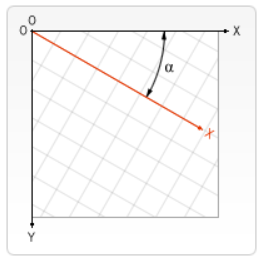

参数：

1. angle：顺时针旋转的弧度(degree * Math.PI / 180)

旋转的中心始终是 `canvas` 的原点 (0, 0)，x 轴顺时针旋转，如果要改变中心点，我们可以通过 translate() 方法移动 `canvas`。

注意：在 `canvas` 中 rotate 是累加的。

```js
ctx.translate(50, 50)
// 顺时针旋转 45 度
ctx.rotate(45 * Math.PI / 180)
ctx.fillRect(0, 0, 100, 100)
```


### 伸缩变换

ctx.scale(x, y)：将当前 `canvas` 画布的 x 轴和 y 轴进行伸缩变换。

参数：

1. x：水平方向的缩放因子。
2. y：垂直方向的缩放因子。

注意：

- 在 `canvas` 中 scale 是累加的。

- 缩放因子为 1 时大小不变，值为负数按照 x 轴或 y 轴进行翻转（翻转上下文）。

> 默认的，在 `canvas` 中一个单位实际上就是一个像素。例如，如果我们将 0.5 作为缩放因子，最终的单位会变成 0.5 像素，并且形状的尺寸会变成原来的一半。相似的方式，我们将 2.0 作为缩放因子，将会增大单位尺寸变成两个像素。形状的尺寸将会变成原来的两倍。

图像伸缩：

```js
ctx.translate(50, 50)
// x 轴放大 2 倍，y 轴不变
ctx.scale(2, 1)
ctx.fillRect(0, 0, 100, 100)
```

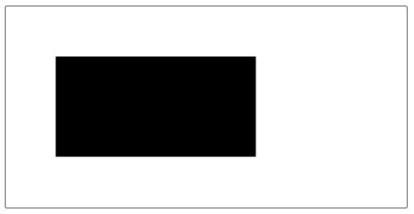

文字翻转：

```js
// x 轴放大 2 倍，并翻转，y 轴不变
ctx.scale(-2, 1)
ctx.font = '48px serif'
ctx.fillText('canvas', -200, 100)
```

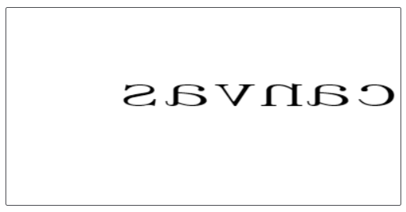

## canvas背景

### 图片背景

ctx.drawImage(img, sx, sy, swidth, sheight, x, y, width, height)：在画布上绘制图片。

参数：

1. img：图像源对象（规定使用的图像、画布或视频等）。
2. sx：可选，开始剪切的x坐标位置。
3. sy：可选，开始剪切的y坐标位置。
4. swidth：可选，被剪切图像的宽度。
5. sheight：可选，被剪切图像的高度。
6. x：在画布上放置图像的x坐标位置。
7. y：在画布上放置图像的y坐标位置。
8. width：可选，要使用的图像的宽度（伸展或缩小图像）。
9. height：可选，要使用的图像的高度（伸展或缩小图像）。

注意：必须要等图片加载完才能操作，参数必须如下 3 种方式(3, 5, 9)。

演示模板：

```html

<canvas id="canvas" width="400" height="200" style="border: 1px solid"></canvas>
```

- ctx.drawImage(img, x, y)：在画布上定位图像。

```js
const img = new Image()
img.src = './img/react.png'
img.onload = () => {
  // 将图片绘制到画布上
  ctx.drawImage(img, 0, 0)
}
```

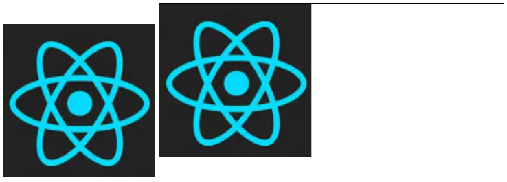

- ctx.drawImage(img, x, y, width, height)：在画布上定位图像，并规定图像的宽度和高度。

```js
ctx.drawImage(img, 0, 0, 100, 100)
```

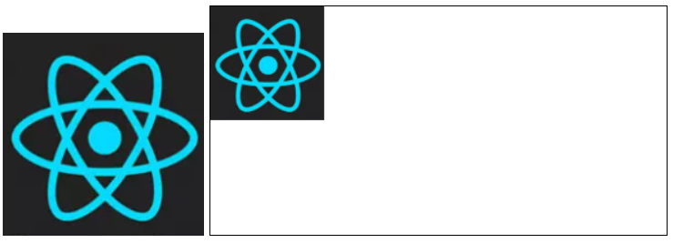

- ctx.drawImage(img, sx, sy, swidth, sheight, x, y, width, height)：剪切图像，并在画布上定位被剪切的部分。

```js
ctx.drawImage(img, 0, 0, 100, 100, 0, 0, 100, 100)
```

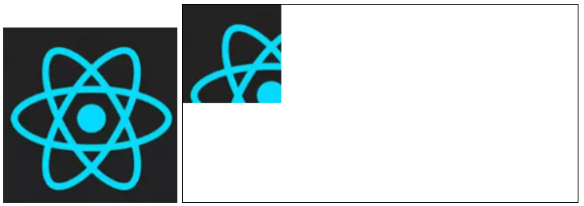

### 设置背景

ctx.createPattern(image, repetition)：创建一个用于图像绘制使用的样式。

参数：

1. image：图像源对象（规定使用的图像、画布或视频等）。
2. repetition：重复图像的方式，值只能是 repeat | repeat-x | repeat-y | no-repeat。

> repetition 如果为空字符串 ('') 或 null (但不是 undefined )，repetition将被当作 repeat。

```js
// 创建背景样式
const pat = ctx.createPattern(img, 'repeat')
ctx.fillStyle = pat
ctx.fillRect(0, 0, 300, 100)
```

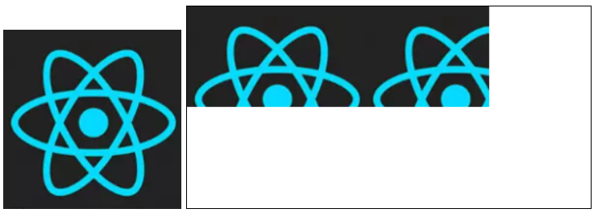

## canvas渐变

### 线性渐变

ctx.createLinearGradient(x1, y1, x2, y2)：从 (x1, y1) 到 (x2, y2) 进行渐变。

该方法返回一个 CanvasGradient 对象。

使用 CanvasGradient 身上的 addColorStop(position, color) 设置渐变颜色。

参数：

1. position：介于 0-1 之间的值，表示渐变中开始与结束之间的位置。
2. color：在position位置显示的css颜色值。

```js
// 从 (0, 0) 坐标点到 (300, 0) 坐标点进行渐变
const line = ctx.createLinearGradient(0, 0, 300, 0)
// 渐变顺序 红 --> 蓝 --> 绿
line.addColorStop(0, 'red')
line.addColorStop(.5, 'blue')
line.addColorStop(1, 'green')
// 图像填充颜色设置为渐变色
ctx.fillStyle = line
ctx.fillRect(0, 0, 300, 100)
```

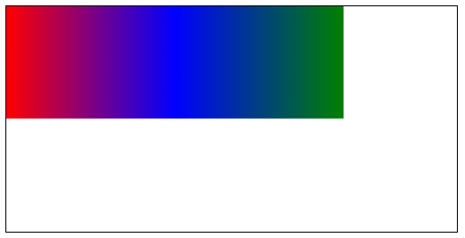

### 径向渐变

ctx.createRadialGradient(x1, y1, r1, x2, y2, r2)：从 (x1, y1) 为圆心，半径为 r1 的圆，向 (x2, y2) 为圆心，半径为 r2 的圆进行径向渐变。

使用方法跟上述的 createLinearGradient 一样。

```js
// 以 (200, 100) 为圆心 50 为半径，向 100 为半径的圆渐变
const grad = ctx.createRadialGradient(200, 100, 50, 200, 100, 100)
// 渐变顺序 红 --> 蓝 --> 绿
grad.addColorStop(0, 'red')
grad.addColorStop(.5, 'blue')
grad.addColorStop(1, 'green')
// 图像填充颜色设置为渐变色
ctx.fillStyle = grad
ctx.fillRect(0, 0, 400, 200)
```
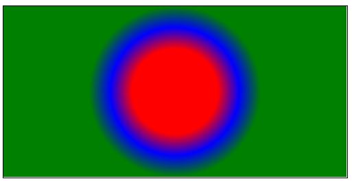


## canvas文本相关

注意：文本相对于画布的偏移量，都是参照文本的基线进行偏移的。

### 渲染文本

`canvas` 中提供了两种方法渲染文本，如下：

- ctx.fillText(text, x, y, [maxWidth])：在 (x, y) 填充指定的文本 (text)。

- ctx.strokeText(text, x, y, [maxWidth])：在 (x, y) 绘制文本边框 (text)。

参数：

1. text：文本内容。
2. x, y：偏移量。
3. maxWidth：字体绘制的最大宽度，绘制字体宽度超出最大宽度会水平自适应。

```js
// 边框文本
ctx.strokeText('天天好心情', 50, 50)
// 填充文本
ctx.fillText('天天好心情', 50, 100)
// 填充文本现在宽度
ctx.fillText('天天好心情', 50, 150, 30)
```


### 文本样式

#### 设置字体

ctx.font：font 属性指定时，必须要有大小和字体，缺一不可。

默认字体 10px sans-serif。

```js
// 字体大小设置为 30px
ctx.font = '30px sans-serif'
ctx.strokeText('天天好心情', 50, 50)
```

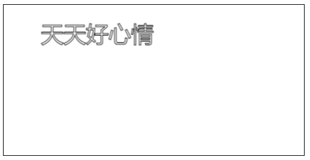

#### 文本对齐方式

ctx.textAlign：设置文本的对齐方式，值如下：

- start：文本对齐界线开始的地方。（默认值）

- end：文本对齐界线结束的地方。

- left：文本左对齐。

- right：文本右对齐。

- center：文本居中对齐。

>这里的 textAlign = 'center' 比较特殊。textAlign 的值为 center 时候文本的居中是基于你在 (fillText / strokeText) 的时候所给的x的值，也就是说文本一半在 x 的左边，一半在 x 的右边（可以理解为计算 x 的位置时从默认文字的左端，改为文字的中心，因此你只需要考虑 x 的位置即可）。所以，如果你想让文本在整个 `canvas` 居中，就需要将 (fillText / strokeText) 的x值设置成 `canvas` 的宽度的一半。

```js
ctx.font = '30px sans-serif'
// 文本居中对齐
ctx.textAlign = 'center'
ctx.strokeText('天天好心情', 50, 50)
```
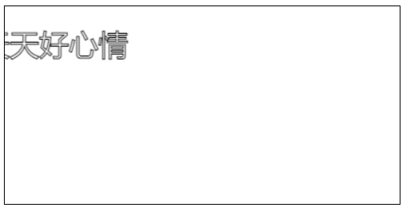

#### 文本基线对齐方式

文本相对于画布的偏移量，都是参照文本的基线进行偏移的，设置基线在文本中的位置，可以调整文本在 `canvas` 画布中的位置。

ctx.textBaseline：描绘绘制文本时，当前文本基线的属性，值如下：

- alphabetic：文本基线是标准的字母基线。（默认值）

- top：文本基线在文本块的顶部。

- middle: 文本基线在文本块的中间。

- bottom：文本基线在文本块的底部。

- hanging：文本基线是悬挂基线。

- ideographic：文本基线是表意字基线。

> 如果字符本身超出了 alphabetic 基线，那么 ideographic 基线位置在字符本身的底部。

```js
ctx.font = '30px sans-serif'
ctx.textAlign = 'center'
// 基线设置在文本的顶部
ctx.textBaseline = 'top'
ctx.strokeText('天天好心情', 50, 50)
```


### 文本在canvas中垂直居中显示

通过之前的两种对齐方式，我们可以使文本在 `canvas` 画布中垂直居中显示。

```js
ctx.font = '30px sans-serif'
// x 轴偏移画布一半，水平按文本中间对齐
ctx.textAlign = 'center'
// y 轴偏移画布一半，基线设置在文本的中心位置
ctx.textBaseline = 'middle'
ctx.fillText('天天好心情', canvas.width / 2, canvas.height / 2)
```


### 获取文本信息

ctx.measureText(text)：返回一个 TextMetrics 对象，包含关于文本尺寸的信息（一般都用来获取文本的宽度）。

参数：

1. text：文本内容。

```js
ctx.font = '100px serif'
// 返回当前文本的相关信息
const textInfo = ctx.measureText('天天好心情')
console.log(textInfo)
```

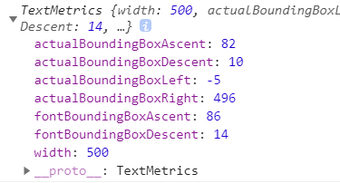

字体大下设置为 100px，一共 5 个字，所以宽度是 500px。

## canvas阴影

设置 `canvas` 图像或文字阴影需要如下属性：

1. ctx.shadowOffsetX：图像 x 轴延伸距离。（默认值 0）
2. ctx.shadowOffsetY：图像 y 轴延伸距离。（默认值 0）
3. ctx.shadowBlur：用来设定阴影的模糊程度，其数值并不跟像素数量挂钩，也不受变换矩阵的影响。（默认值 0）
4. ctx.shadowColor：必须是标准的CSS颜色值，用于设定阴影颜色效果。（默认是全透明的黑色）

```js
// 图像阴影向左移动 10px
ctx.shadowOffsetX = 10
// 图像阴影向下移动 10px
ctx.shadowOffsetY = 10
// 模糊程度为 10
ctx.shadowBlur = 10
// 阴影颜色为红色
ctx.shadowColor = 'red'
ctx.fillRect(50, 50, 100, 100)
```

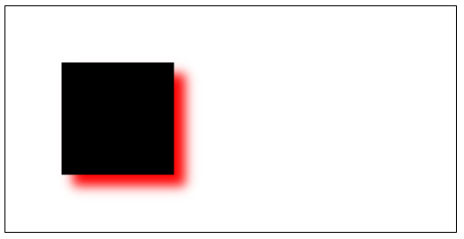

## canvas像素相关

### 获取区域内像素信息

ctx.getImageData(x, y, width, height)：返回一个 ImageData 对象，用来描述 `canvas` 区域隐含的像素数据，这个区域通过矩形表示，起始点是 (x, y)，宽为 width，高为 height。

imageData 对象中存储着 `canvas` 对象真实的像素数据，它包含以下几个**只读属性**：

- width：图片的宽度，单位是像素。

- height：图片的高度，单位是像素。

- data：Uint8ClampedArray 类型的一维数组，包含着 RGBA 格式的整型数组，范围在 0-255 之间 (包括255)。按图像从左到右，从下到下记录像素的。

```js
const img = new Image()
img.src = './img/react.png'
img.onload = () => {
  ctx.drawImage(img, 0, 0, 100, 100)
  // 获取绘制图像区域内的相关信息
  const imgData = ctx.getImageData(0, 0, 100, 100)
  console.log(imgData)
}
```

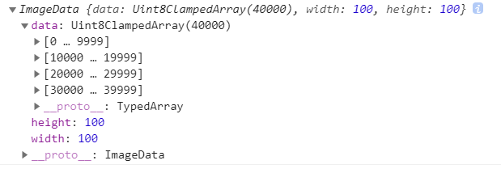

图像的长和宽都是 100，所以一共有 10000 个像素点 (100 * 100)，因为一个像素点对应一个 RGBA 值，一个 RGBA 值由 4 个数值构成，所以 data 数组的长度为 40000。

该数组每 4 个值构成一个像素点。

### 对画布进行像素数据的写入

ctx.putImageData(imagedata, dx, dy)

ctx.putImageData(imagedata, dx, dy, dirtyX, dirtyY, dirtyWidth, dirtyHeight)

>将数据从已有的 ImageData 对象绘制到位图的方法。 如果提供了一个绘制过的矩形，则只绘制该矩形的像素。此方法不受画布转换矩阵的影响。

参数：

1. imagedata：包含像素值的数组对象。
2. dx：源图像数据在目标画布中的位置偏移量（x 轴方向的偏移量）。
3. dy：源图像数据在目标画布中的位置偏移量（y 轴方向的偏移量）。
4. dirtyX：可选，在源图像数据中，矩形区域左上角的位置。默认是整个图像数据的左上角（x 坐标）。
5. dirtyY：可选，在源图像数据中，矩形区域左上角的位置。默认是整个图像数据的左上角（y 坐标）。
6. dirtyWidth：可选，在源图像数据中，矩形区域的宽度。默认是图像数据的宽度。
7. dirtyHeight：可选，在源图像数据中，矩形区域的高度。默认是图像数据的高度。

```js
const img = new Image()
img.src = './img/react.png'
img.onload = () => {
  ctx.drawImage(img, 0, 0, 100, 100)
  const imgData = ctx.getImageData(0, 0, 100, 100)
  // 将 ImageData 对象重新写入到画布中
  ctx.putImageData(imgData, 200, 100, 0, 0, 50, 50)
}
```

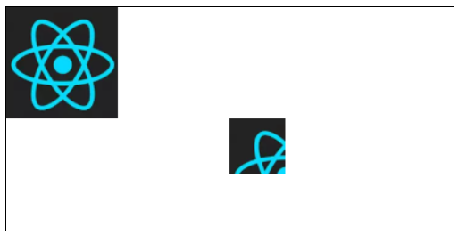

### 创建imageData对象

ctx.createImageData(width, height)

ctx.createImageData(imagedata)

> 创建一个新的、空的、指定大小的imageData 对象，所有像素在新对象中都是透明的。（data 数组中的值都是 0）

参数：

1. width：imageData 新对象的宽度。
2. height：imageData 新对象的高度。
3. imagedata：从现有的 ImageData 对象中，复制一个和其宽度和高度相同的对象。图像自身不允许被复制。（data 数组中的值都是 0）

```js
const img = new Image()
img.src = './img/react.png'
img.onload = () => {
  ctx.drawImage(img, 0, 0, 100, 100)
  const imgData = ctx.getImageData(0, 0, 100, 100)
  // 根据老的 ImageData 对象，创建一个新的 ImageData 对象
  const imgDataByData = ctx.createImageData(imgData)
  console.log('imgDta创建', imgDataByData)
  // 根据指定的宽高，创建一个新的 ImageData 对象
  const imgDataByRect = ctx.createImageData(10, 10)
  console.log('宽高创建', imgDataByRect)
}
```

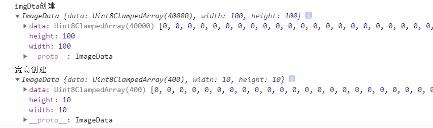

### 像素扩展

#### 获取某个坐标的像素

通过 getImageData 方法我们可以获取到整个 `canvas` 画布的像素信息。已知坐标 (x, y)，通过 (y * canvas.width + x) 可以获取这是第几个像素。因为一个像素包含 RGBA 4 个数值，所以最后获取到的像素为 (y * canvas.width + x) * 4，加上紧跟的后 3 位所对应的数值构成的 RGBA 值。

```js
// 获取 imageData 中某个坐标的像素
function getPixelInfo(imageData, x, y) {
  const { width, data } = imageData
  const pixel = []
  const index = (y * width + x) * 4
  pixel[0] = data[index]
  pixel[1] = data[index + 1]
  pixel[2] = data[index + 2]
  pixel[3] = data[index + 3]
  return pixel
}
```

测试一下：

```js
ctx.fillStyle = 'red'
ctx.fillRect(10, 10, 1, 1)
const imgData = ctx.getImageData(0, 0, canvas.width, canvas.height)
// 获取 (10, 10) 这个坐标点的像素信息
const pixel = getPixelInfo(imgData, 10, 10)
console.log(pixel)
```

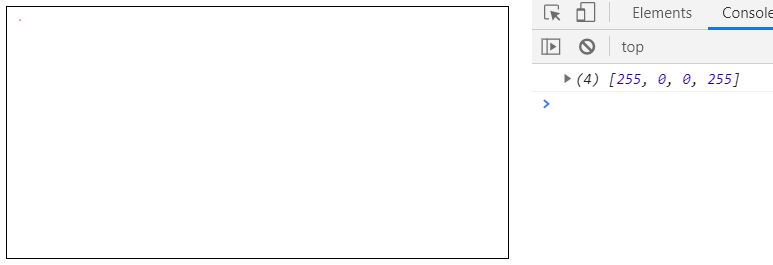

#### 设置某个坐标的像素

基本原理跟获取坐标像素一样，我们可以传入一个 RGBA 值来设置某些坐标的像素。

```js
// 设置 imageData 中某个坐标的像素
function setPixelInfo(imageData, x, y, rgba) {
  const { width, data } = imageData
  const index = (y * width + x) * 4
  data[index] = rgba[0]
  data[index + 1] = rgba[1]
  data[index + 2] = rgba[2]
  data[index + 3] = rgba[3]
}
```

测试一下：

```js
// 创建一个10 * 10 imageData 对象
const imgData = ctx.createImageData(10, 10)
// RGBA 红色
const rgba = [255, 0, 0, 255]
for (let y = 0; y < 10; y++) {
  for (let x = 0; x < 10; x++) {
    // 将每个像素点都设置为红色
    setPixelInfo(imgData, x, y, rgba)
  }
}
// 将 imageData 对象写入到 (100, 100) 开始的位置
ctx.putImageData(imgData, 100, 100)
```

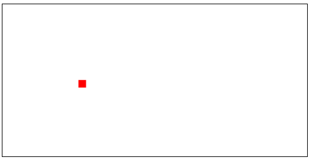

#### 马赛克小练习

现在我们既能获取到坐标位置的像素，也能设置坐标位置的像素。基于这两点我们来实现一个马赛克的效果。

基本思路：

- 假如现在有一个 100 * 100 的图像，将一个像素点看做一个 1 * 1 的小方块，里面就只有一个 RGBA 值，一共有 100 * 100 = 10000 个小方块，10000 个像素点。

- 将这个小方块变大，包含 2 * 2 个像素点，一共有 50 * 50 = 2500 个小方块。

- 现在一个小方块里面包含 4 个像素点，可能存在多个 RGBA 值，随机取出其中的一个 RGBA 值，将这个小方块中的 4 个像素点的 RGNA 值，都设置成随机取出的这个 RGBA 值。

- 现在每个小方块虽然包含 4 个像素点，但是这 4 个像素点的 RGBA 值都一样，也可以看作现在这个图像只有 2500 个像素点，像素点变少了，图像就模糊了，马赛克效果就形成了。

```js
/*
  设置马赛克像素
  imgData：imageData对象
  size：马赛克程度，值越大越模糊（小方块宽高）
*/
function setMosaicPixel(imgData, size) {
  const { width, height } = imgData
  // 小方块变大，所以宽高要除以 size
  for (let y = 0; y < height / size; y++) {
    for (let x = 0; x < width / size; x++) {
      // 随机获取小方块中的 (x, y) 坐标
      const randomX = x * size + Math.floor(Math.random() * size)
      const randomY = y * size + Math.floor(Math.random() * size)
      // 获取这个坐标像素点的 RGBA 值
      const randomPixel = getPixelInfo(imgData, randomX, randomY)
      // 将这个小方块中的像素点都应用这个 RGBA 值
      for (let MosaicX = 0; MosaicX < size; MosaicX++) {
        for (let MosaicY = 0; MosaicY < size; MosaicY++) {
          setPixelInfo(imgData, x * size + MosaicX, y * size + MosaicY, randomPixel)
        }
      }
    }
  }
}
```

测试一下：

```js
const img = new Image()
img.src = './img/react.png'
img.onload = () => {
  // 绘制图像
  ctx.drawImage(img, 0, 0, 200, 100)
  // 获取图像的信息
  const imgData = ctx.getImageData(0, 0, 200, 100)
  // 将图像马赛克化
  setMosaicPixel(imgData, 2)
  // 最后重新写入到画布中
  ctx.putImageData(imgData, 0, 0)
}
```

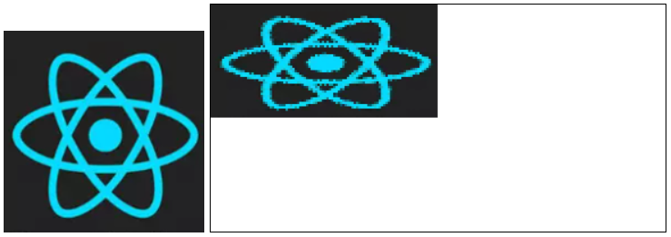

## canvas透明度

ctx.globalAlpha：这个属性影响到 `canvas` 里所有图像的透明度，有效的值范围是 0（完全透明）到 1（完全不透明），默认是 1。

```js
// 画布全局透明度设置为 0.2
ctx.globalAlpha = .2
ctx.fillStyle = 'red'
ctx.fillRect(50, 50, 50, 50)
ctx.fillStyle = 'blue'
ctx.fillRect(150, 50, 50, 50)
```

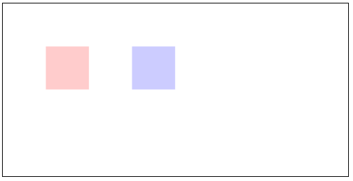

## canvas图像合成设置

ctx.globalCompositeOperation：设置或返回如何将一个源（新的 source）图像绘制到目标（已有的 destination）的图像上。

可选值如下：

| 属性值 | 描述 |
| -----: | :---- |
| source-over | 源在上面，新的图像层级比较高。（默认值） |
| source-in | 只留下源与目标的重叠部分。（源的那一部分） |
| source-out | 只留下源超过目标的部分。 |
| source-atop | 砍掉源溢出的部分。 |
| destination-over | 目标在上面，旧的图像层级比较高。 |
| destination-in | 只留下源与目标的重叠部分。（目标的那一部分） |
| destination-out | 只留下目标超过源的部分。 |
| destination-atop | 砍掉目标溢出的部分。 |
| lighter | 显示源图像 + 目标图像。（重叠图形的颜色是通过颜色值相加来确定的） |
| copy | 显示源图像，忽略目标图像。 |
| xor | 那些重叠和正常绘制之外的其他地方是透明的。 |

```js
// 设置图像重叠的地方不显示
ctx.globalCompositeOperation = 'xor'
ctx.fillStyle = 'red'
ctx.fillRect(50, 50, 50, 50)
ctx.fillStyle = 'blue'
ctx.fillRect(75, 75, 50, 50)
```

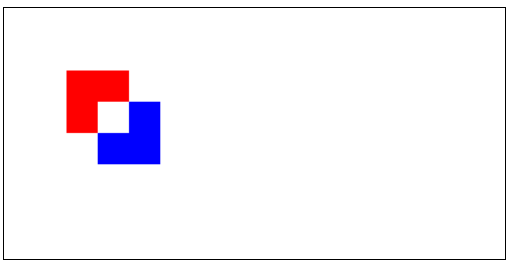

### 刮刮卡小练习

通过 globalCompositeOperation 属性设置，可以实现一个简单的刮刮卡效果。

基本思路：

- 将 `canvas` 画布填充一个颜色，和最后要显示的图片宽高设为一致，通过定位将画布覆盖在图片上方

- 给 `canvas` 元素绑定鼠标按下事件，获取当前鼠标按下位置的 offsetX 和 offsetY，相当于在画布中的偏移量，设置起点 moveTo(offsetX, offsetY)。

- 给 `canvas` 元素绑定鼠标移动事件，鼠标按下移动时，实时获取鼠标相对于画布的偏移量，设置 lineTo(offsetX, offsetY)，并将这些路径连接起来。

- 设置 ctx.globalCompositeOperation = 'destination-out'，只留下不是鼠标移动绘制形成的区域，重叠的区域将会透明显示，最下方的图片就能看见。

- 给 `canvas` 元素绑定鼠标松开事件，清除 `canvas` 身上的鼠标移动事件。

```html
<!-- 结构设置 -->
<div style="width: 400px;height: 200px;position: relative">
  <canvas id="canvas" width="400" height="200" style="border: 1px solid;position: absolute"></canvas>
  
</div>
```

```js
// 获取 canvas 元素的宽高
const { width, height } = canvas
// 将整个画布填充为灰色
ctx.fillStyle = 'gray'
ctx.fillRect(0, 0, width, height)
// 只留下目标超过源的部分
ctx.globalCompositeOperation = 'destination-out'
// 刮卡的粗细设置为 20px
ctx.lineWidth = 20
// 将绘线的路径连接处和两端都设置为圆形，这样比较好看
ctx.lineJoin = 'round'
ctx.lineCap = 'round'
// 为 canvas 元素绑定鼠标按下事件
canvas.onmousedown = function(event) {
  // 获取当前鼠标在画布中的偏移量
  const { offsetX, offsetY } = event
  // 设置起点
  ctx.moveTo(offsetX, offsetY)
  // 为 canvas 元素绑定鼠标移动事件
  canvas.onmousemove = function(event) {
    // 实时获取鼠标的偏移量
    const { offsetX, offsetY } = event
    // 设置路径点
    ctx.lineTo(offsetX, offsetY)
    // 将子路径连接起来绘制显示
    ctx.stroke()
  }
  // 为 canvas 元素绑定鼠标离开事件
  canvas.onmouseup = () => {
    // 清除 canvas 元素身上的鼠标移动事件
    canvas.onmousemove = null
  }
}
```

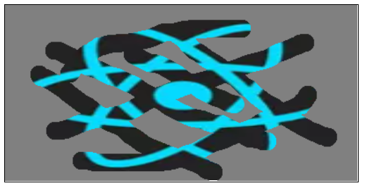

## canvas将画布导出为图像

canvas.toDataURL(type, encoderOptions)。

通过 `canvas` 身上的 toDataURL 方法，返回一个包含画布内容的 base64 格式的 data url。

参数：

1. type：图片格式，默认为 image/png。
2. encoderOptions：在指定图片格式为 image/jpeg 或 image/webp 的情况下，可以从 0-1 之间选择图片的质量。如果超出取值范围，将会使用默认值0.92。其他参数会被忽略。

```js
ctx.fillStyle = 'red'
ctx.fillRect(50, 50, 100, 100)
const dataUrl = canvas.toDataURL()
// data:image/png;base64,iVBORw0KGgoAAAANSUh....
console.log(dataUrl)
```

地址栏输入 data url：

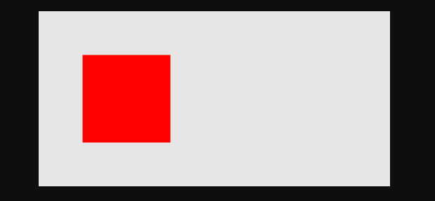

## canvas事件操作

`canvas` 中几乎没有提供任何事件操作的方法，但是我们可以通过 isPointInPath 方法，判断当前坐标是否在路径列表中，从而进行一些事件操作。

ctx.isPointInPath(x, y)：判断在当前路径中是否包含检测点 (x, y)，返回 true / false。

特别注意：

- ctx.beginPath() 之前的路径检测不到，因为它会清空路径列表。

- fillRect 和 strokeRect 这两个直接绘制矩形的方法不会生成路径，它们包含的坐标点 isPointInPath 检查不到。

```js
// 绘制一个路径矩形
ctx.rect(50, 50, 100, 100)
ctx.fill()

// 给 canvas 绑定点击事件
canvas.onclick = event => {
  // 鼠标点击位置距离 canvas 的 offsetX 和 offsetY，就相当于在 canvas 中的坐标位置
  const { offsetX, offsetY } = event
  const isInPath = ctx.isPointInPath(offsetX, offsetY)
  console.log(`当前点击坐标：(${offsetX}, ${offsetY})`, `是否在路径列表中：${isInPath}`)
}
```

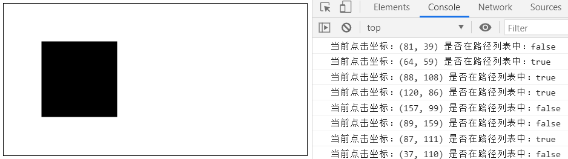
