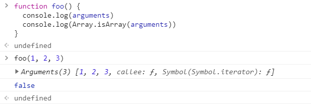

# 函数Function

函数也是一个对象，函数中可以封装一些功能代码，在需要时可以执行这些功能代码。

使用 typeof 检查一个函数时，会返回 function。

```js
typeof function() {} // function
```

## 创建函数

封装到函数中的代码不会立即执行，函数中的代码会在函数调用的时候执行，当调用函数时，函数中封装的代码会按照顺序执行。

**构造函数创建函数**

可以将要封装的代码以字符串的形式传递给构造函数。

```js
var foo = new Function('console.log("函数")')
```

我们在实际开发中很少使用构造函数来创建一个函数对象，因为这样比较繁琐。

**函数声明**

```js
function foo([arg...]) {
  ...
}
```

**函数表达式**

```js
var foo = function([arg...]) {
  ...
}
```

## 函数的参数

定义函数时，可以在 `()` 中指定一个或多个形参（形式参数）。

多个形参之间使用逗号隔开，声明形参就相当于在函数内部声明了对应的变量，但是并没赋值。

在调用函数时，可以在 `()` 中指定实参（实际参数），实参将会赋值给函数中对应的形参。

调用函数时解析器不会检查实参的类型，所以要注意，是否有可能会接收到非法的参数，如果有可以则需要对参数进行类型的检查。

函数的实参可以是任意的数据类型。

调用函数时，解析器也不会检查实参的数量，多余的实参不会被赋值，如果实参的数量少于形参的数量，则没有对应实参的形参将是 undefined。

## 函数返回值

可以使用 `return` 关键字来设置函数的返回值。

```js
function foo() {
  return 100
}

const n = foo() // n = 100
```

如果函数中不写 `return`，或者 `return` 后面不跟任何值就相当于返回一个 undefined。

```js
function foo1() {
  return
}

function foo2() {}

const n1 = foo1() // undefined
const n2 = foo2() // undefined
```

`return` 后的语句都不会执行。

```js
function foo() {
  console.log(1)
  return
  console.log(2)
}

foo() // 只会打印 1
```

`return` 后可以跟任意类型的值。

## 立即执行函数

函数定义完，立即被调用，这种函数叫做立即执行函数（IFEE）。

立即执行函数往往只会执行一次。

```js
// 函数声明
(function foo() {
  console.log(1)
})() // 直接打印 1

// 函数表达式
const foo = function() {
  console.log(1)
}() // 直接打印 1
```

立即执行函数也能传递参数。

```js
(function foo(a, b) {
  console.log(a + b)
})(1, 2) // 打印 3
```

## arguments

在调用函数时，浏览器每次都会传递两个隐含的参数：

- 函数的上下文对象：this。

- 封装实参的对象：arguments。

arguments 是一个伪数组，但不是数组，它也可以通过索引来操作数据，也可以获取长度。



在调用函数时，我们所传递的实参都会在 `arguments` 中保存。

即使我们不定义形参，也可以通过 `arguments` 来使用实参，只不过比较麻烦。

```js
function foo() {
  console.log(arguments[0])
  console.log(arguments[1])
}

foo(1, 2) // 打印 1 2
```

`arguments` 里面有一个属性叫做 `callee`，这个属性对应一个函数对象，就是当前正在指向的函数的对象。

```js
function foo() {
  console.log(arguments.callee === foo)
}

foo() // true
```
