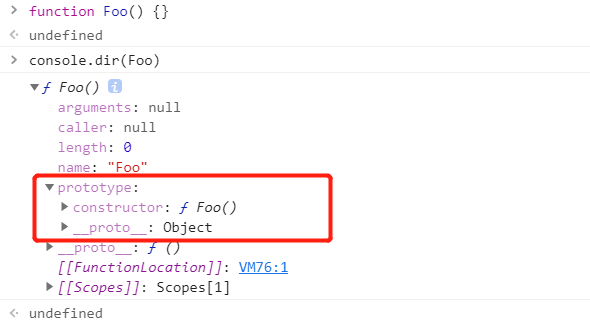

# 构造函数

创建一个构造函数，专门用来创建对象。

构造函数就是一个普通的函数，创建方式和普通函数没有区别。

不同的是构造函数习惯上首字母大写。

## new

构造函数和普通函数的区别就是调用方式不同。

普通函数是直接调用，而构造函数需要使用 `new` 关键字来调用。

```js
function Foo() {
  this.a = 1
  this.b = 2
}

new Foo() // 返回一个对象 { a: 1, b: 2 }
```

## 构造函数的执行流程

- 立刻创建一个新对象。

- 给对象设置 `__proto__`，值为构造函数对象的 `prototype` 属性值。

- 将新创建的对象设置为函数中的 `this`，在构造函数中可以使用 `this` 来引用新建的对象。

- 逐步执行函数中的代码。

- 如果没有明确指定返回值，将新建的对象作为返回值返回。

如果返回的是一个复杂类型，将直接返回这个复杂类型。

```js
function Foo1() {
  this.a = 1
  this.b = 2
  return {}
}

function Foo2() {
  this.a = 1
  this.b = 2
  return []
}

function Foo3() {
  this.a = 1
  this.b = 2
  return function() {}
}

new Foo1() // {}
new Foo2() // []
new Foo3() // function() {}
```

如果返回的是一个基本类型，这个基本类型将会忽略，返回的依旧是新建的对象。

```js
function Foo() {
  this.a = 1
  this.b = 2
  return ''
}

new Foo() // { a: 1, b: 2 }
```

## 实例

使用构造函数创建的对象叫做实例。

使用同一构造函数创建的对象，我们称为一类对象，也将一个构造函数称为一个类。

我们将通过一个构造函数创建的对象，称为是该类的实例。

每一个实例都是单独存在的。

```js
function Foo() {
  this.a = 1
  this.b = 2
}

const f1 = new Foo()
const f2 = new Foo()

f1 === f2 // false
```

## instanceof

使用 `instanceof` 可以检查一个对象是否是一个类的实例。

如果是，则返回 true，否则返回 false。

```js
function Foo() {}
function Stu() {}

const foo = new Foo()
const stu = new Stu()

foo instanceof Foo // true
stu instanceof Foo // false
```

所有的对象都是 `Object` 的后代。

所以任何对象和 `Object` 做 `instanceof` 检查时都会返回 true。

```js
function Foo() {}
function Stu() {}

const foo = new Foo()
const stu = new Stu()

foo instanceof Object // true
stu instanceof Object // true
```

## 原型（prototype）

我们所创建的每一个函数，解析器都会向函数中添加一个属性 `prototype`。

这个属性对应着一个对象，这个对象就是我们所谓的原型对象。



如果函数作为普通对象调用，`prototype` 没有任何作用。

当函数以构造函数的形式调用时，它所创建的实例对象都会有一个隐含的属性（\_\_proto\_\_），指向该构造函数的原型对象，我们可以通过 `__proto__` 来访问该属性。

```js
function Foo() {}

const foo = new Foo()

foo.__proto__ === Foo.prototype // true
```

原型对象相当于一个公共的区域，所有同一个类的实例都可以访问到这个原型对象，我们可以将实例对象中共有的内容，统一设置到原型对象中。

当我们访问对象的一个属性或方法时，它会先在对象自身中寻找，如果有则直接使用，如果没有则会去原型对象中寻找，如果找到则直接使用。

以后我们创建构造函数时，可以将这些对象共有的属性和方法，统一添加到构造函数的原型对象中去，节省内存空间，这样不用分别为每一个对象添加，也不会影响到全局作用域，就可以使每个对象都具有这些属性和方法了。

```js
function Foo() {}

Foo.prototype.name = 'foo'
Foo.prototype.say = function() {
  console.log('say')
}

const foo1 = new Foo()
const foo2 = new Foo()

foo1.name // foo
foo2.name // foo

foo1.say() // 打印 say
foo2.say() // 打印 say

foo1.__proto__.say === foo2.__proto__.say // true
```

使用 `in` 检查对象中是否含有某个属性时，如果对象中没有，但是原型对象上有，也会返回 `true`，这不是我们想要的。

可以使用对象的 `hasOwnProperty()` 方法来检查对象自身是否含有该属性，只有当对象自身含有该属性的时候才会返回 `true`。

```js
function Foo(name) {
  this.name = name
}

const foo = new Foo('foo')

'name' in foo // true
'__proto__' in foo // true

foo.hasOwnProperty('name') // true
foo.hasOwnProperty('__proto__') // false
```

原型对象也是对象，所以它也有原型，当我们使用一个对象的属性或方法时，会先在自身中寻找。

自身中如果有，则直接使用。

如果没有则去原型对象中寻找，如果原型对象中有则使用。

如果没有则去原型的原型对象中寻找，直到找到 `Object` 对象的原型。

`Object` 对象的原型没有原型（null），如果在 `Object` 原型中依然没有找到，则会返回 `undefined`。

```js
Object.prototype.__proto__ // null

const obj = new Object()

obj.hasOwnProperty // ƒ hasOwnProperty() { [native code] }
obj.name // undefined
```
