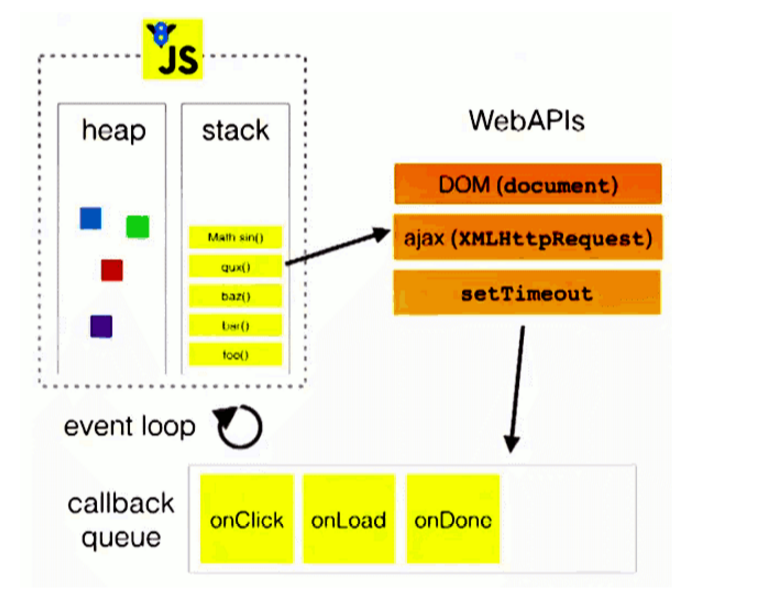

# 线程机制与事件机制

## 进程与线程

进程：程序的一次执行，它占有一片独有的内存空间，可以通过 window 任务管理器查看进程。

线程：是进程内的一个独立执行单元，是程序执行的一个完整流程，也是 cpu 的基本（最小）调度单元。

进程和线程的关系：

- 应用程序必须运行在某个进程的某个线程上。

- 一个进程中一般至少有一个运行的线程：主线程。

- 一个进程中也可以同时运行多个线程，我们会说程序是多线程运行的。

- 一个进程内的数据可以供其中的多个线程直接共享。

- 多个进程之间的数据是不能直接共享的。

- 线程池：保存多个线程对象的容器，实现线程对象的反复利用。

浏览器运行是单进程还是多进程？

- 有的是单进程：Firebox、老版 IE。

- 有的是多进程：Chrome、新版 IE。

如何查看浏览器是否是多进程运行的呢？

- 任务管理器 --> 进程。

## 浏览器内核

支持浏览器运行的最核心的程序。

不同的浏览器可能不太一样。

- Chrome，Safari：webkit。

- Firefox：Gecko。

- IE：Trident。

- 360、搜狗等国内浏览器：Trident + webkit。

内核由很多模块组成：

**主线程：**

- js 引擎模块：负责 js 程序的编译与运行。

- html，css 文档解析模块：负责页面脚本的解析。

- dom，css 模块：负责 dom、css 在内存中的相关处理。

- 布局和渲染模块：负责页面的布局和效果的绘制。

**分线程：**

- 定时器模块：负责定时器的管理。

- 事件响应模块：负责事件的管理。

- 网络请求模块：负责 ajax 请求。

## js是单线程的

如何证明 js 执行是单线程的？

- `setTimeout()` 的回调函数是在主线程执行的。

- 定时器回调函数只有在运行栈中的代码全部执行完后才有可能执行。

为什么 js 要用单线程模式，而不是多线程模式？

- JavaScript 的单线程，与它的用途有关。

- 作为浏览器脚本语言，JavaScript 的主要用途是与用户互动，以及操作 dom。

- 这决定了 js 只能是单线程，否则会带来很复杂的同步问题。

代码分类：

- 初始化代码。

- 回调代码。

js 引擎执行代码的基本流程。

- 先执行初始化代码，包含一些特别的代码。  
设置定时器。  
绑定事件监听。  
发送 ajax 请求。

- 后面在某个时刻才会执行回调代码。

扩展：

- js 是单线程执行的（回调函数也是在主线程）。

- H5 提出了实现多线程的方案：Web Worker。

- 只能在主线程更新界面。

## 事件循环模型

所有代码分类：

- 初始化执行代码（同步代码）：包含绑定 dom 事件监听，设置定时器，发送 ajax 请求的代码。

- 回调执行代码（异步代码）：处理回调逻辑。

- js 引擎执行代码的基本流程：初始化代码 --> 回调代码。

模型的 2 个重要组成部分：

- 事件（定时器、dom 事件、ajax）管理模块。

- 回调队列。

模型的运转流程：

1. 执行初始化代码，将事件回调函数交给对应模块管理。

2. 当事件发生时，管理模块会将回调函数及其数据添加到回调队列中。

3. 只有当初始化代码执行完后（可能要一定时间），才会遍历读取回调队列中的回调函数执行（先进先出）。



## 定时器引发的思考

定时器真的是定时执行的吗？

- 定时器并不能保证真正定时执行。

- 一般会延迟一丁点（可以接受），也有可能延迟很长一段时间（不能接受）。

- 如果在主线程执行了一个长时间的操作，可能导致延时才处理。

```js
for(var i = 0; i < 1000000000; i++) {}
setTimeout(function() {
  console.log('定时器执行了')
}) // 虽然没有设置延时多久执行，但是要等主线程上的任务执行完了才会执行异步回调
```

定时器回调函数是在主线程执行的，js 是单线程。

定时器是通过事件循环模型实现的。

## Web Worker

H5 规范提供了 js 分线程的实现，取名为 Web Worker。

相关 API：

- `Worker`：构造函数，加载分线程执行的 js 文件。

- `Worker.prototype.onmessage`：用于接收另一个线程的回调函数（event.data 是接收到的数据）。

- `Worker.prototype.postMessage`：向另一个线程发送消息。

不足：

- Worker 内代码不能操作 dom（更新 ui）。

- 分线程中的全局对象不再是 window，所以在分线程中不可能更新界面。

- 不能跨域加载 js。

- 不是每个浏览器都支持这个新特性。

```js
// 创建一个 Worker 对象
var worker = new Worker('worker.js')
// 绑定接收消息的监听
worker.onmessage = function(event) {
  console.log('主线程接收分线程返回的数据：' + event.data)
  alert(event.data)
}

var data = 'xx'

// 向分线程发送消息
worker.postMessage(data)
console.log('主线程向分线程发送数据：' + data)
```

worker.js
```js
console.log(this) // DedicatedWorkerGlobalScope 对象
this.onmessage = function(event) {
  console.log('分线程接收到主线程发送的数据：' + event.data)
  var data = 'xxx'
  postMessage(data)
  console.log('分线程向主线程返回数据：' + data)
  // alert(data) alert 是 window 的方法，在分线程不能调用
  // 分线程中的全局对象不再是 window，所以在分线程中不可能更新界面
}
```
