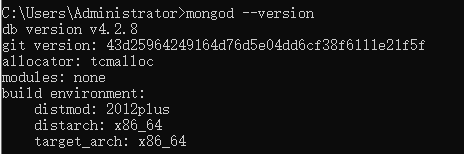

# MongoDB

`MongoDB` 是一个 `NoSQL` 的数据库，也是一款文档型数据库。

- 可以有多个数据库（database）。

- 一个数据库中可以有多个集合（表 collection）。

- 一个集合中可以有多个文档（表记录 document）。

- 文档结构很灵活，没有任何限制。

`MongoDB` 非常灵活，不需要像 `mysql` 一样先创建数据库、表、设计表结构。

在这里只需要，当你需要插入数据的时候，只需要指定往哪个数据库的哪个集合操作就可以了。

一切由 `MongoDB` 来帮你自动完成建库建表这件事。

## 安装使用 MongoDB

在 `MongoDB` 官网直接下载安装。

安装完成将 `mongoDB/bin` 这个路径添加为环境变量。

根目录创建 data 文件夹，在 data 文件夹中创建 db 文件夹作为 MongoDB 数据库文件的存储文件。

**注意：必须在根目录下创建 data 文件夹**。

cmd 命令行输入 `mongod --version` 显示一下信息就说明安装成功了。



### 启动 MongoDB 数据库（mongod）

`MongoDB` 默认使用执行 `mongod` 命令启动 `MongoDB` 服务器，所处盘符根目录下的 `/data/db` 作为自己的数据库存储目录。

`/data/db` 目录不会主动创建，所以在第一次执行该命令之前先自己手动新建一个 `/data/db`，没有 `/data/db` 这个目录数据库是启动不成功的。

修改默认的数据存储目录（/data/db）：`mongod --dbpath 数据存储目录路径`。

关闭数据库：在命令行直接 `ctrl + c` 即可停止，或者直接关闭开启服务的控制台也可以。

### 连接数据库（mongo）

打开数据库后，命令行输入 `mongo` 就可以连接数据库了。

退出连接：`exit`、`ctrl + c` 或者直接关闭连接数据库的控制台。

## MongoDB 基本命令

- `show dbs`：查看显示所有数据库。

- `db`：查看当前操作的数据库。

- `use dbName`：切换到指定数据库（如果没有会新建）。

- `db.dropDatabase()`：删除数据库。

- `db.createCollection(name)`：创建集合。  
就算没有创建指定集合，`db.<collection>.insert()` 插入数据的时候也会自动创建相关集合。

- `show collections`：查看数据库下的所有集合。

- `db.<collection>.drop()`：删除一个集合。

### 插入文档

- `db.<collection>.insert(obj / arr)`：向集合插入一个或多个文档。  
当我们向集合插入文档时，如果没有给文档指定 `_id` 属性，则数据库会自动为文档添加 `_id`。  
`_id` 为文档的唯一标识。  
`_id` 我们可以自己指定，这是数据库就不会自动添加了，但是一定要确保它的唯一性。

- `db.<collection>.insertOne(obj)`：插入一个文档对象。

- `db.<collection>.insertMany(arr)`：插入多个文档对象。

### 查询文档

- `db.<collection>.find([query, [projection]])`：查询一个集合内所有符合条件的文档，返回一个数组。  
query：查询条件。  
projection：可选，使用投影操作符指定返回的键，查询时返回文档中所有键值，只需省略该参数即可（默认省略）。

```js
db.<collection>.find({}, { [key]: 1, _id: 0 })
/*
  key: 1 投影显示文档中 key 的字段及属性值（_id 字段默认显示）
  key: 0 投影显示文档中 key 以外的字段及属性值（_id 字段默认显示）
  _id: 0 不显示 _id 字段
*/
```

**注意：设置的 key 要么为 1，要么为 0，否则逻辑不成立，会报错**。

- `db.<collection>.findOne()`：用来查询集合中符合条件的第一个文档，返回的是文档对象。

- `db.<collection>.count()`：查询一个集合中的文档数量。

- `db.<collection>.find().limit(num)`：设置需要显示文档的数量。

- `db.<collection>.find().skip(num)`：跳过指定数量的数据。

- `db.<collection>.find().sort({ [key]: 1 })`：对文档数据进行排序。  
查询文档时，默认是按照 `_id` 的值进行升序排列。  
需要传递一个对象来指定排序规则。  
&emsp;1 表示升序。  
&emsp;-1 表示降序。  
设置多个字段进行升序降序排列时，先根据第一个字段的设置进行排序，如果该字段有相同的属性值，再根据第二个字段的设置进行排序，如果第二个字段也存在相同的属性值，并且它们所在文档的第一个字段（sort 设置的字段）的属性相同，再根据第三个字段的设置进行排序，依次类推。

**注意：MongoDB 会自动调整 skip、limit 和 sort 的位置**。

### 修改文档

- `db.<collecction>.update(query, update[,upsert[,multi[,writeConcern]]])`：修改集合中的数据。  
query：查询条件，查询出符合条件的数据。  
&emsp;$eq：等于。  
&emsp;$gt：大于。  
&emsp;$gte：大于等于。  
&emsp;$lt：小于。  
&emsp;$lte：小于等于。  
&emsp;$ne：不等于。  
&emsp;$or：或查询条件，条件放在数组中。  
&emsp;$elemMatch：根据数组里的元素，查询符合条件的文档。

```js
// 例如有一条这样的数据：{ _id: 1, name: [ { a: 1 },{ a: 2 } ] }
db.<collection>.find({ name: { $elemMatch: { a: 1 } } })
// 这样就能查询出来
```

update：新对象，默认情况下会使用新对象来替代旧对象。

如果需要修改指定的属性，而不是替换，需要使用 `修改操作符` 来完成修改。

- `$set`：修改文档中的指定属性（`{$set:{key:value}}`）。

- `$unset`：删除文档中的指定属性（`{$unset:{key:1}}`）。

- `$push`：向数组中添加一个新元素。

- `$addToSet`：向数组中添加一个新元素，如果存在，则不会添加。

- `$inc`：将一个字段的值增加或者减少。

upsert：可选，默认 false，如果不存在 update 记录，是否插入新的数据，true 为插入。

multi：可选，默认 false，更新所有符合条件的数据还是更新第一条符合条件的数据，true 为更新所有。

writeConcern：可选，抛出异常的级别。

- `db.<collection>.updateMany()`：同时修改多个符合条件的文档。

- `db.<collection>.updateOne()`：修改一个符合条件的文档。

- `db.<collection>.replaceOne()`：替换一个文档。

### 删除文档

- `db.<collection>.remove([query[,justOne]])`：删除集合中符合条件的文档。  
query：可选，删除文档的条件。  
justOne：可选，boolean 类型。  
&emsp;true：只删除第一个文档。  
&emsp;false：（默认）删除所有匹配条件的文档。

- `db.<collection>.deleteOne()`：删除第一个符合条件的文档。

- `db.<collection>.deleteMany()`：删除所有符合条件的文档。

一般数据库中的数据都不会删除，所以删除的方法很少调用，一般会在数据中添加一个字段，来表示数据是否被删除。

### 内嵌文档

`MongoDB` 中文档的属性值也可以是一个文档，当一个文档的属性值是一个文档时，我们称为这个文档为 `内嵌文档`。

查询内嵌文档通过 `.` 的形式来匹配。

```js
// 文档数据：{ a: { b: 123 } }
db.<collection>.find({ 'a.b': 123 }) // 此时属性名必须加引号
// 这样就能查询到数据
```
