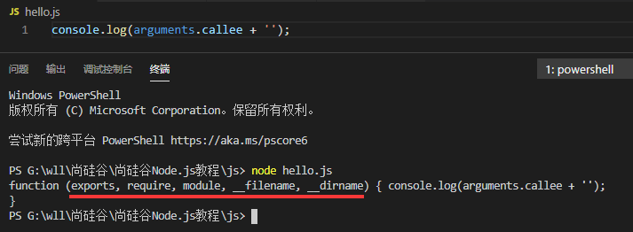

# node简介

`node` 是 ES 标准的一个实现，node 也是一个 js 引擎。

**注意：node 不是一个库，也不是一门语言，是一个 js 运行时的环境，使用 c++ 编写的。**

通过 node 可以使 js 代码在服务器端执行。

node 采用的是 v8 引擎（Google Chrome 的内核）。

node 仅仅对 ES 标准进行了实现，所以在 node 中不包含 `DOM` 和 `BOM`。

node 可以在后台来编写服务器（node 编写的服务器都是单线程的服务器）。

- `进程`：进程就是一个一个的工作计划（工厂中的车间）。

- `线程`：线程是计算机最小的运算单位，线程是干活的（工厂中的工人）。

传统的服务器都是多线程的：每进来一个请求，就创建一个线程去处理请求。

node 的服务器是单线程的：node 处理请求时是单线程，但是在后台拥有一个 `I/O` 线程池。

node 采用 Google 开发的 v8 引擎运行 js 代码，使用事件驱动、非阻塞和异步 I/O 等技术来提高性能，可优化应用程序的传输量和规模。

node 特点：

- 非阻塞、异步的 I/O。

- 事件和回调函数。

- 单线程（主线程单线程，后台 I/O 线程池）。

- 跨平台。

## node 中的模块化

node 默认采用的 `CommonJS` 模块化，在 node 中，一个 js 文件就是一个模块。

在 node 中，每一个 js 文件中的 js 代码都是独立运行在一个函数中，而不是全局作用域，所以一个模块中的变量和函数在其他模块中无法访问。

我们可以通过 `exports` 来向外部暴露变量和方法。只需要将需要暴露给外部的变量或方法设置为 `exports` 的属性即可。

```js
exports.propName = value
```

### 引入模块

在 node 中，通过 `require()` 函数来引入外部的模块。

require() 可以传递一个文件的路径作为参数，node 将会自动根据该路径来引入外部模块。

这里的路径，如果使用相对路径，必须以 `.` 或者 `..` 开头。

使用 require() 引入模块后，加载文件模块并执行里面的代码。该函数会返回一个对象，这个对象代表的是引入的模块。

我们使用 require() 引入外部模块时，使用的就是模块标识，我们可以通过模块标识来找到指定的模块。

模块分为三大类：

- `核心模块`：由 node 引擎提供的模块，核心模块的标识就是模块的名字。

- `第三方模块`：由第三方机构或个人提供，第三方模块的标识也是它的名字。

- `文件模块`：由用户自己创建的模块，文件模块的标识就是文件的路径（绝对路径、相对路径 --> 相对路径使用 `.` 或 `..` 开头）。

## global 全局对象

在 node 中有一个全局对象 `global`，它的作用和网页中的 window 类似。

在全局中创建的未定义直接赋值的变量（函数）都会作为 global 的属性（方法）保存。

当 node 在执行代码模块时，它会将文件中的代码放在一个函数中：

```js
function(exports, require, module, __filename, __dirname) {
  // 模块中的代码
}
```

实际上模块中的代码都是包装在一个函数中执行的，并且在函数执行时，同时传递了 5 个参数：

- `exports`：该对象用来将变量或函数暴露到外部。

- `require`：函数，用来引入外部的模块。

- `module`：module 代表的是当前模块本身，exports 就是 module 的属性，即可以使用 exports 导出，也可以使用 module.exports 导出。

```js
module.exports === exports // true
```

通过 exports 只能使用 `.` 的方式来向外暴露内部变量。

```js
exports.propName = value
```

而 module.exports 即可以通过 `.` 的形式，也可以直接赋值。

```js
module.exports.propName = value

module.exports = { ... }
```

- `__filename`：当前模块的完整路径。

- `__dirname`：当前模块所在文件夹的完整路径。



## 文件操作中的路径

在文件操作中，使用相对路径是不可靠的，因为在 node 中文件操作的路径被设计为相对于执行 node 命令所处的路径。

这不是 bug，人家这样设计是有使用场景的（开发命令行工具）。

把下相对路径变为绝对路径就可以了。

- `__dirname`：动态获取当前文件模块所属目录的绝对路径。

- `__filename`：动态获取当前文件的绝对路径。

在路径的拼接过程中，为了避免手动拼接带来的一些低级错误，推荐使用 `path.join()` 来辅助拼接。

```js
const path = require('path')
path.join(__dirname, /* 相对路径 */)
```

**提醒：require 模块中的路径标识和这里的路径没关系，不受影响（主要影响的是文件模块）**。
