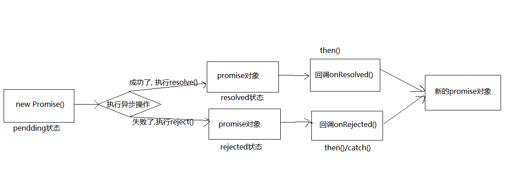

# Promise的理解和使用

## Promise 是什么

抽象表达：`Promise` 是 `js` 中进行异步编程的新的解决方案（旧的是异步回调）。

具体表达：

- 从语法上来说：`Promise` 是一个构造函数。

- 从功能上来说：`Promise` 对象用来封装一个异步操作并可以获取其结果。

`Promise` 的状态改变（只有 2 种，只能改变一次）。

- `pending` 变为 `resolved(fulfilled)`。

- `pending` 变为 `rejected`。

说明：只有这 2 种，且一个 `Promise` 对象只能改变一次。无论变为成功还是失败，都会有一个结果数据。成功的结果数据一般称为 `value`，失败的结果数据一般称为 `reason`。

## Promise 的基本流程

## 为什么要用 Promise

指定回调函数的方式更加灵活：可以在请求发出甚至结束后指定回调函数。

- 旧的：必须在启动异步任务前指定。

- `Promise`：启动异步任务 --> 返回 `Promise` 对象 --> 给 `Promise` 对象绑定回调函数（甚至可以在异步结束后指定/多个）。

支持链式调用，可以解决回调地狱的问题。

- 回调地狱：回调函数嵌套调用，外部回调函数异步执行的结果是嵌套回调函数执行的条件。

- 回调地狱的缺点：不便于阅读，不便于异常处理。

- 解决方案：`Promise` 链式调用。

- 终极解决方案：`async` / `await`。
