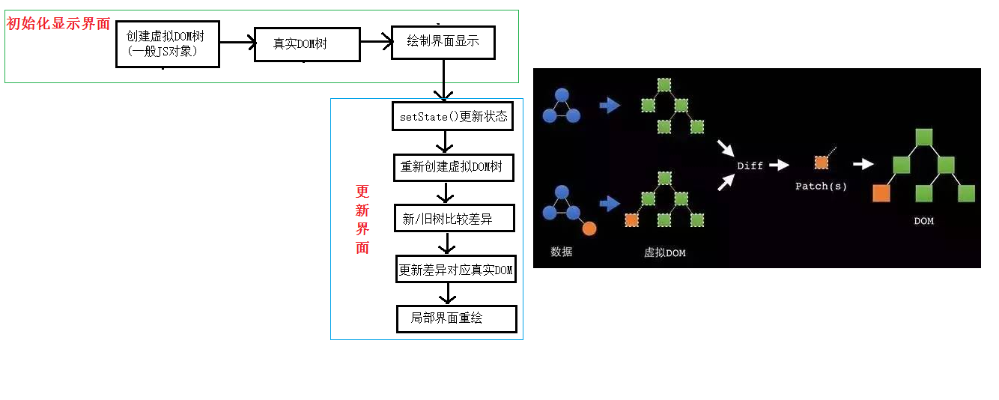

# React中的diff算法

## 虚拟 DOM 中 key 的作用

简单的说：`key` 是虚拟 `DOM` 对象的标识，在更新显示时 `key` 起着极其重要的作用。

详细的说：当状态中的数据发生变化时，`react` 会根据【新数据】生成【新的虚拟 DOM】，随后 `react` 进行【新虚拟 DOM】与【旧虚拟 DOM】的 diff 比较。

比较规则如下：

- 旧虚拟 DOM 中找到了与新虚拟 DOM 相同的 key。  
若虚拟 DOM 中内容没变，直接使用之前的真实 DOM。  
若虚拟 DOM 中内容变了，则生成新的真实 DOM，随后替换掉页面之前的真实 DOM。

- 旧虚拟 DOM 中未找到与新虚拟 DOM 相同的 key。  
根据数据创建新的真实 DOM，随后渲染到页面。

## 用 index 作为 key 可能会引发的问题

若对数据进行逆向添加、逆向删除等破坏顺序的操作，会产生没有必要的真实 DOM 更新（页面效果没问题，但效率低）。

如果结构中还包含输入类的 DOM，会产生错误 DOM 更新（页面有问题）。

最好使用每条数据的唯一标识作为 `key`（id、手机号、身份证等）。

如果不存在对数据进行逆向添加、逆向删除等破坏顺序操作，仅用于渲染列表展示，使用 `index` 作为 `key` 也是可以的。
