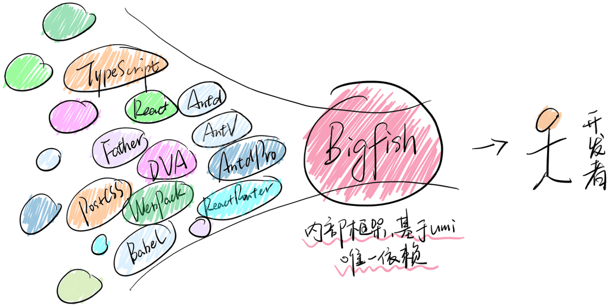

# Umi相关

`umi` 中文可发音为乌米，是一个可插拔的企业级 `react` 应用框架。`umi` 以路由为基础的，支持类 `next.js` 的约定式路由，以及各种进阶的路由功能，并以此进行功能扩展，比如支持路由级的按需加载。`umi` 在约定式路由的功能层面会更像 `nuxt.js` 一样。

开箱即用，省去了搭框架的时间。

**技术收敛。**



这张图是给内部框架 `Bigfish` 画的，套在 `umi` 上同样合适。他把大家常用的技术栈进行整理，收敛到一起，让大家只用 `umi` 就可以完成 80% 的日常工作。

**插件和插件集。**


`umi` 支持插件和插件集，通过这张图应该很好理解到它们的关系，通过插件集我们把插件收敛依赖然后支持不同的业务类型。

**配置式路由和约定式路由。**

`umi` 的路由即支持配置式，又支持约定式。配置式是对于现实的低头，也是大部分用户在用的，因为它功能强大；约定式是我们希望走去的方向，因为它简洁优雅。

**.umi 临时文件。**

`.umi` 临时目录是整个 `umi` 项目的发动机，你的入口文件、路由等等都在这里，这些是由 `umi` 内部插件及三方插件生成的。

你通常会在 `.umi` 下看到以下目录。

```js
|--.umi
|--|--core // 内部插件生成
|--|--pluginA // 外部插件生成
|--|--pluginB // 外部插件生成
|--|--umi.ts // 入口文件
```

临时文件是 `umi` 框架中非常重要的一部分，框架或插件会根据你的代码生成临时文件，这些原来需要放在项目里的脏乱差的部分都被藏在了这里。

你可以在这里调试代码，但不要在 `.git` 仓库里提交它，因为它的临时性，每次启动 `umi` 时都会被删除并重新生成。

## Umi 路由

`umi` 会根据 `pages` 目录自动生成路由配置。**需要注释.umirc.ts，routes 相关，否则自动配置不生效。**

```js
// .umirc.ts
import { defineConfig } from 'umi'

export default defineConfig({
  nodeModulesTransform: {
    type: 'none'
  },
  // routes: [
  //   { path: '/', component: '@/pages/index' }
  // ],
  fastRefresh: {}
})
```

**全局 Layout。**

约定 `src/layouts/index.tsx` 为全局路由。然后一个 `react` 组件，并通过 `props.children` 渲染子组件。

目录结构。

```js
|--src
|--|--layouts
|--|--|--index.tsx
```

```js
import Tabbar from '../components/Tabbar'

export default function Layouts(props: any) {
  const { location: { pathname } } = props
  return (
    <div>
      {props.children}
      {pathname === '/login' || <Tabbar />}
    </div>
  )
}
```

**基础路由。**

如果没有 `routes` 配置，`umi` 会进入约定式路由模式，然后分析 `src/pages` 目录拿到路由配置。

目录结构。

```js
|--pages
|--|--Home.tsx
|--|--About.tsx
```

页面上访问地址 `/home` 或者 `/about` 都会渲染对应的路由组件。

**重定向。**

目录结构。

```js
|--pages
|--|--index.tsx
|--|--Home.tsx
|--|--About.tsx
```

```js
// pages/index.tsx
import { Redirect } from 'umi'

export default function Index() {
  return <Redirect to='home' />
}
```

**嵌套路由。**

`umi` 里约定目录下有 `_layout.tsx` 时会生成嵌套路由，以 `_layout.tsx` 为该目录的 layout，layout 文件需要返回一个 `react` 组件，并通过 `props.children` 渲染子组件。

目录结构。

```js
|--pages
|--|--about
|--|--|--_layout.tsx
|--|--|--List.tsx
|--|--|--Detail.tsx
```

```js
// pages/about/_layout.tsx
export default function AboutLayout(props: any) {
  return (
    <>
      <h1>AboutLayout</h1>
      {props.children}
    </>
  )
}
```

**动态路由。**

约定 `[]` 包裹的文件或文件夹为动态路由。

目录结构。

```js
|--pages
|--|--about
|--|--|--_layout.tsx
|--|--|--List.tsx
|--|--|--detail
|--|--|--|--[id].tsx
```

```js
// pages/about/detail/[id].tsx
export default function Detail(props: any) {
  return <h1>Detail--{props.match.params.id}</h1>
}
```

**路由拦截。**

通过指定高阶组件 `wrappers` 达成效果。

```js
// pages/Home.tsx
function Home() {
  return <h1>Home</h1>
}

Home.wrappers = ['@/wrappers/Auth']
```

```js
// wrappers/Auth.tsx
import { Redirect } from 'umi'

export default function Auth(props: any) {
  return isAuth ? <div>{props.children}</div> : <Redirect to='/login' />
}
```

这样，访问 `/home`，就会进行权限验证，验证通过就渲染 `src/pages/Home.tsx`，否则就会跳转到 `/login`，由 `src/pages/login` 进行渲染。

**404 路由。**

约定 `src/pages/404.tsx` 为 404 页面，需返回 `react` 组件。

```js
// src/pages/404.tsx
export default function NotFount() {
  return <h1>404</h1>
}
```

**路由模式。**

在 `.umirc.ts` 中配置 `history` 模式。

```js
// .umirc.ts
import { defineConfig } from 'umi';

export default defineConfig({
  nodeModulesTransform: {
    type: 'none'
  },
  history: {
    type: 'hash', // hash 模式
    type: 'browser' // history 模式 默认
  },
  fastRefresh: {}
})
```

## 反向代理

在 `.umirc.ts` 中新增 `proxy` 配置。

```js
// .umirc.ts
import { defineConfig } from 'umi'

export default defineConfig({
  proxy: {
    '/api': {
      target: 'https://xxx.com',
      changeOrigin: true
    }
  }
})
```
