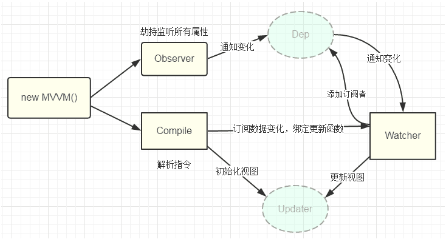

# Vue源码解析

## 前提准备

- `[].slice.call(lis)`：将伪数组转换为真数组。

- `node.nodeType`：得到节点类型。

- `Object.defineProperty(obj, propertyName, options)`：给对象定义属性（指定描述符）。  
`configurable`：boolean 类型，是否可以重新定义或者删除。  
`enumerable`：boolean 类型，是否可以枚举。  
`writable`：boolean 类型，是否可以被修改。  
`value`：指定初始值。  
`get`：函数，用来得到当前属性值。  
`set`：函数，用来监视当前属性值的变化。

- `Object.keys(obj)`：得到对象自身可枚举的属性名组成的数组。

- `DocumentFragment`：文档碎片（高效批量更新多个节点）。  
`document`：对应显示的页面，包含 n 个 element，一旦 document 内部的某个元素改变，界面就会更新。  
`documentFragment`：内存中保存 n 个 element 的容器对象（不与界面联系），如果更新 fragment 中的某个 element，界面是不更新的。全部更新完再一次渲染到页面，提高性能。

- `obj.hasOwnProperty(propName)`：判断 propName 是否是 obj 自身的属性。

## 数据代理

通过一个对象代理对另一个对象中属性的操作（读 / 写）。

通过 `vm` 对象来代理 data 对象中所有属性的操作。

好处：更方便的操作 data 中的数据。

基本实现流程：

- 通过 `Obejct.defineProperty()` 给 vm 添加与 data 对象的属性对应的属性描述符。

- 所有添加的属性都包含了 `get` 和 `set`。

- 在 `get` 和 `set` 内部去操作 data 中对应的属性数据。

## 模板解析

模板解析的关键对象：compile 对象。

模板解析的基本流程：

- 将 `el` 的所有子节点全部取出，添加到一个新建的文档 `fragment` 对象。

- 将 `fragment` 中的所有层次子节点递归进行编译解析处理。  
对表达式文本节点进行解析。  
对元素节点的指令属性进行解析。  
事件指令解析。  
一般指令解析。

- 将解析后的 `fragment` 添加到 `el` 中显示。

**解析表达式文本节点：**

根据正则对象得到匹配出的表达式字符串。

```js
const str = '{{name}}';
/\{\{(.*)\}\}/.test(str);
// RegExp.$1 --> name
```

从 data 中取出表达式对应的属性值。

将属性值设置为文本节点的 `textContent`。

```js
textNode.textContent = value
```

**事件指令解析：**

从指令中取出事件名 `v-on:click="callback"`。

根据事件指令的值（表达式）从 `methods` 中得到对应的事件处理函数。

给当前元素节点绑定指定事件名和回调函数的 `DOM` 事件监听。

指令解析完后，移除此指令属性。

```js
elementNode.addEventListener(eventName, callback.bind(vm), false)
```

**一般指令解析：**

得到指令名和指令值。

从 data 中根据表达式得到对应的值。

根据指令名确定需要操作元素节点的什么属性。

- `v-text`：textContent 属性。

- `v-html`：innerHTML 属性。

- `v-class`：className 属性。

- ...

将得到的表达式的值设置到对应的属性上。

移除元素的指令属性。

## 通过数据劫持实现数据绑定

`数据绑定(model --> view)`：一旦更新了 data 中的某个属性数据，所有页面上直接使用或间接使用了此属性的节点都会更新。

`数据劫持`：数据劫持是 vue 中用来实现数据绑定的一种技术。

- 基本思想：通过 `Object.defineProperty()` 来监视 data 中所有属性（任意层次）数据的变化，一旦变化就去更新界面。

**四个重要对象：**

`Observer(观察者)`：

- 用来对 data 所有属性数据进行劫持的构造函数。

- 给 data 中所有属性重新定义属性描述，设置 `get` 和 `set`。

- 为 data 中的每个属性创建对应的 dep 对象。

`Dep(Depend依赖)`：

- data 中的每个属性（所有层次）都对应一个 dep 对象。

- 创建的时机：在初始化重新定义 data 中各个属性时创建对应的 dep 对象，或者在 data 中的某个属性值被设置为新的对象时。  
对象的结构：`{ id, subs }`。  
&emsp;id：每个 dep 都有一个唯一的 id。  
&emsp;subs：包含 n 个对应 Watcher 的数组（subscribes 的简写，订阅）。

- subs 属性说明：  
当一个 Watcher 被创建时，内部会将当前 Watcher 对象添加到对应的 dep 对象的 subs 中。  
当 data 属性的值发生改变时，所有 subs 中的 Watcher 都会收到更新的通知，从而最终更新对应的界面。

`Compile(编译)`：

- 用来解析模板页面的对象的构造函数（一个实例）。

- 利用 `compile` 对象解析模板页面。

- 每解析一个表达式（非事件指令）都会创建一个对应的 Watcher 对象，并建立 Watch 与 dep 的关系。

- compile 与 watcher 的关系：一对多的关系。

`Watcher(监视)`：

- 模板中每个非事件指令或表达式都对应一个 Watcher 对象。

- 监视当前表达式数据的变化。

- 创建的时机：在初始化编译模板时。

- 对象的组成：`{ vm, exp, cb, value, depIds }`。  
vm：vue 实例对象。  
exp：对应指令的表达式。  
cb：当表达式所对应的数据发生改变的回调函数。  
value：表达式当前的值。  
depIds：表达式中各级属性所对应的 dep 对象的集合对象。主要是为了防止 Watcher 和 Dep 重复建立联系。这个对象的属性名是 dep 的 id，属性值是 dep。

**总结：**

- dep 与 watcher 的关系：多对多。

- 一个 data 中的每个属性都对应一个 dep，一个 dep 中的 subs 可能包含多个 watcher（模板中有几个表达式使用到了属性）。

- 模板中一个非事件表达式对应一个 watcher，一个 watcher 中的 depIds 可能包含多个 dep（表达式中包含了几个 data 属性，比如 a.b.c）。

- 数据绑定使用到两个核心技术：`Object.defineProperty()` 和 `消息订阅与发布`。

- dep 与 data 中的属性一一对应。

- watcher 与模板中一般指令和大括号表达式一一对应。

**问题：**

- 什么时候一个 dep 中关联多个 watcher？  
多个指令或表达式用到了当前同一个属性。

```html
<div>{{ name }}</div>
<div>{{ name }}</div>
```

- 什么时候一个 watcher 中关联多个 dep？  
多层表达式的 watcher 对应多个 dep。

```html
<div>{{ a.b.c }}</div>
```

## 双向数据绑定

双向数据绑定是建立在单向数据绑定（model --> view）的基础之上的。

双向数据绑定的实现流程：

- 在解析 `v-model` 指令时，给当前元素添加 `input` 事件监听。

- 当 `input` 的 value 发生改变时，将最新的值赋值给当前表达式所对应的 data 属性。

- 触发属性的 `set` 方法，进行数据劫持更新界面。


