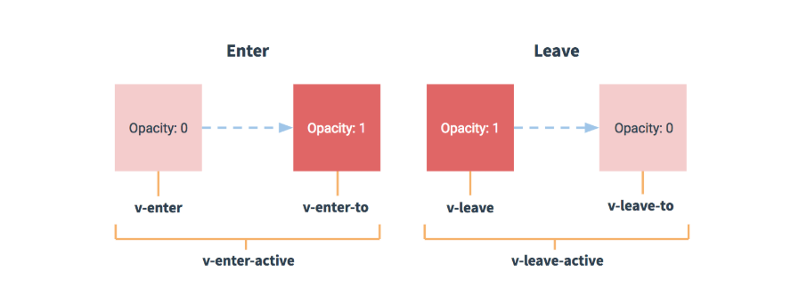

# Vue过渡动画

操作 css 的 `transition` 或 `animation`。

vue 会给目标元素添加或移除特定的 class 类名。

## 过渡类名

- `v-enter-active`：进入过渡生效时的状态。  
`v-enter`：进入过渡的开始状态。  
`v-enter-to`：进入过渡的结束状态。

- `v-leave-active`：离开过渡生效时的状态。  
`v-leave`：离开过渡的开始状态。  
`v-leave-to`：离开过渡的结束状态。

`v-` 开头的类名 `transition` 标签直接使用生效。

```html
<!-- 使用 transition 标签包裹需要动画的元素 -->
<transition>
  <p v-if="show">显示隐藏</p>
</transition>
```

将 `v-` 换成 `xxx-`，则 `transition` 标签必须使用 name 属性才能使用相关的动画。

```html
<transition name="xxx">
  ...
</transition>
```



### 自定义过渡类名

- `enter-class`。

- `enter-active-class`。

- `enter-to-class`。

- `leave-class`。

- `leave-active-class`。

- `leave-to-class`。

它们的优先级高于普通的类名，这对于 vue 的过渡系统和其他第三方 css 动画库十分有用。

```html
<transition name="xxx" enter-active-class="className" leave-active-class="className"></transition>
```

## 显性的过渡持续时间

```html
<transition :duration="1000"></transition>
```

`duration` 设置的时间是毫秒级别的，也可以定制进入和移出的持续时间。

```html
<transition :duration="{ enter: 500, leave: 800 }"></transition>
```

**注意：duration 设置的过渡时长超过原来的过渡时长无效，只能设置小于原本过渡时长的时间**。

## 过渡钩子函数

入场动画：

- `@before-enter="callback"`

- `@enter="callback"`

- `@after-enter="callback"`

- `@enter-cancelled="callback"`

出场动画：

- `@before-leave="callback"`

- `@leave="callback"`

- `@after-leave="callback"`

- `@leave-cancelled="callback"`

**注意：每个构造函数的第一个参数都是当前元素，enter 和 leave 钩子函数的第二个参数是 done，在 enter 和 leave 中必须使用 done 进行回调，否则它们将被同步调用，过渡会立即完成。**

在 `enter` 和 `leave` 钩子函数中，需要写 `el.offsetWidth`（其他 offset 也行）。这句话没有实际的作用，但是不写，出不来动画效果。可以认为 `el.offsetWidth` 会强制动画刷新。

使用钩子函数过渡的元素添加 `:css="false"`，vue 会跳过 css 的检测，可以避免过渡过程中 css 的影响。

```html
<transition
  v-on:before-enter="beforeEnter"
  v-on:enter="enter"
  v-on:leave="leave"
  v-bind:css="false"
>
  <p v-if="show">Demo</p>
</transition>
```

## 过渡的其他操作

### 初始渲染过渡

```html
<transition appear></transition>
```

`appear` 可以在页面刚加载的时候出现过渡动画。

同时也支持自定义 class 类名。

- `appear-class`。

- `appear-to-class`。

- `appear-active-class`。

也支持钩子函数。

- `@before-appear="callback"`

- `@appear="callback"`

- `@after-appear="callback"`

- `@appear-cancelled="callback"`

### 多个元素过渡

当有相同标签的元素切换时，需要通过 `key` 设置唯一的值来标记，让 vue 区分它们，否则 vue 为了效率只会替换相同标签内部的内容。

```html
<transition>
  <h1 v-if="msg" key="1">显示</h1>
  <h1 v-else key="2"></h1>
</transition>
```

也可以这样：

```html
<transition>
  <h1 :key="msg">{{ msg ? '显示' : '隐藏' }}</h1>
</transition>
```

### 过渡模式

`transition` 标签的默认行为是进入和离开同时发生。

有时候我们需要先离开再进入，或者先进入后离开，所以 vue 提供了过渡模式 `mode`：

- `in-out`：新元素先进行过渡，完成之后当前元素过渡离开。

- `out-in`：当前元素先进行过渡，完成之后新元素过渡进入。

```html
<transition mode="out-in"></transition>
```

### 多个组件过渡

```html
<transition>
  <component :is="componentName"></component>
</transition>
```

## 列表过渡

列表过渡的元素需要使用 `transition-group` 标签。

不同于 `transition`，它会以一个真实元素呈现（默认是 span），可以使用 `tag` 属性更换为其他元素。

```html
<transition tag="div">
  ...
</transition>
```

**注意：**

- 过渡模式 `mode` 不可用，因为我们不再相互切换特有的元素。

- 内部元素总是需要提供唯一的 `key` 值。

- css 过渡类将会应用在内部元素中，而不是这个容器（`transition-group`）本身。

```html
<transition-group name="xxx" tag="ul">
  <li v-for="item in arr" :key="item.id">{{ item.name }}</li>
</transition-group>
```

### 列表排序过渡

`transition-group` 组件还有一个特殊之处，不仅可以进入和离开动画，还可以改变定位 `v-move`。

它会在元素的改变定位的过程中应用（通常结合 `.v-leave-active { position: absolute }`）。

像之前的类名一样，可以通过 `name` 来定义前缀，也可以通过 `move-class` 手动设置。

```html
<style>
  .flip-move {
    transition: all 1s;
  }
</style>

<transition-group name="flip"></transition-group>
```

**注意：使用 FLIP 过渡的元素不能设置为 display: inline，代替方案，可以设置 display: inline-block，或者放置于 flex 容器中**。

`v-move` 在 vue 2.5.0 版本中有问题。
