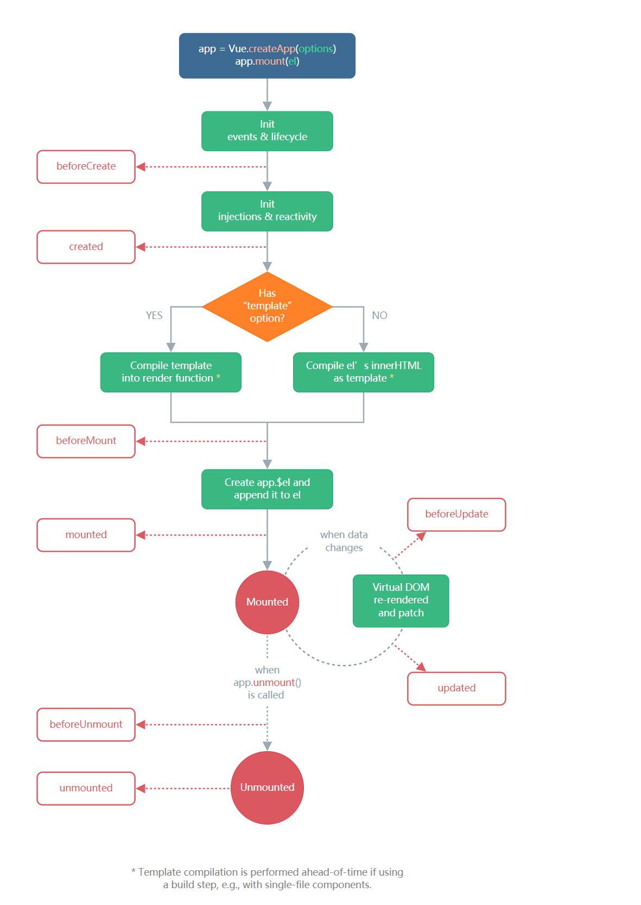

# Vue3生命周期

**Vue3.x 对比 Vue2.x生命周期**

Vue3.x 中可以继续使用 Vue2.x 中的生命周期钩子，但有两个被更名了。

- `beforeDestroy` 改名为 `beforeUnmount`。

- `destroyed` 改名为 `unmounted`。

Vue3.x 也提供了 `Composition API` 形式的生命周期钩子，与 Vue2.x 中钩子对应关系如下：

- `beforeCreate` --> `setup()`

- `created` --> `setup()`

- `beforeMount` --> `onBeforeMount`

- `mounted` --> `onMounted`

- `beforeUpdate` --> `onBeforeUpdate`

- `updated` --> `onUpdated`

- `beforeUnmount` --> `onBeforeUnmount`

- `unmounted` --> `onUnmounted`

**Vue2.x 的生命周期**

**Vue3.x 的生命周期**

