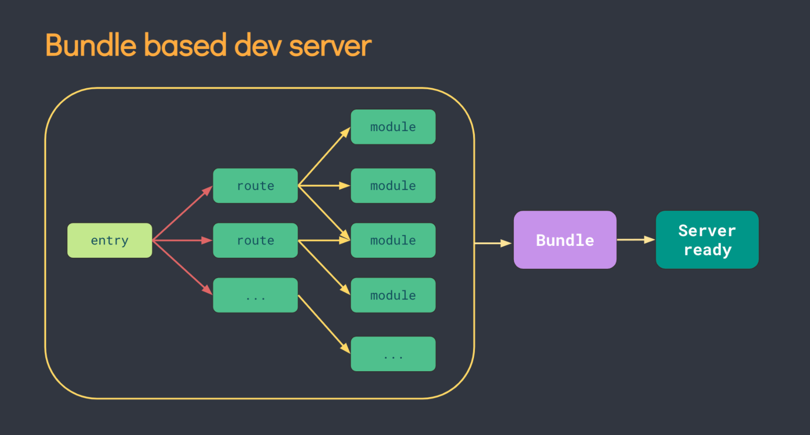
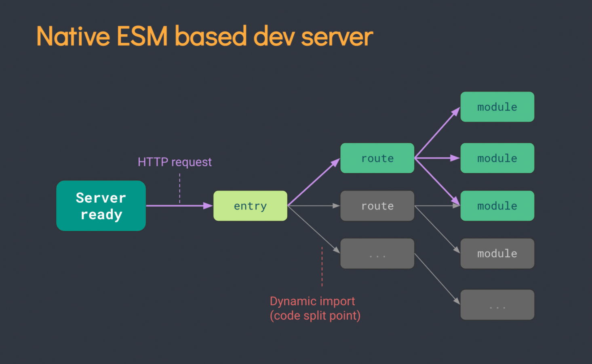

# 创建Vue3工程

**使用 vue-cli 创建**

[官方文档。](https://cli.vuejs.org/zh/guide/creating-a-project.html#vue-create)

查看 `@vue/cli` 版本，确保 `@vue/cli` 版本在 4.5.0 以上。

```js
vue --version
```

安装或者升级你的 `@vue/cli`。

```js
npm install -g @vue/cli
```

创建项目。

```js
vue create vue_test

cd vue_test
npm run serve // 启动项目
```

**使用 vite 创建**

[官方文档。](https://v3.cn.vuejs.org/guide/installation.html#vite)

[vite官网。](https://vitejs.cn)

`vite` 是新一代前端构建工具。

优势如下：

- 开发环境中，无需打包操作，可快速的冷启动。

- 轻量快速的热加载（HMP）。

- 真正的按需编译，不再等待整个应用编译完成。

创建过程：

```js
npm init vite-app project-name // 创建项目

cd project-name // 进入过程目录

npm install // 安装依赖

npm run dev // 运行
```

**传统构建与 vite 构建对比图**




