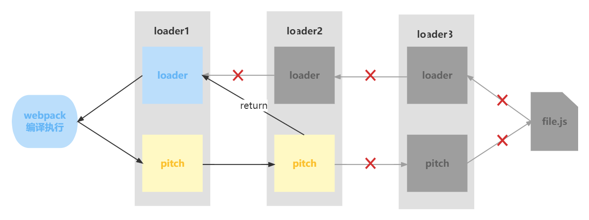

# Loader 原理

帮助 `webpack` 将不同类型的文件转换为 `webpack` 可识别的模块。

## Loader 执行顺序

### 分类

- `pre`：前置 loader。

- `normal`：普通 loader。

- `inline`：内联 loader。

- `post`：后置 loader。

### 执行顺序

- 4 类 loader 的执行优先级为：`pre > normal > inline > post`。

- 相同优先级的 loader 执行顺序为：`从右到左，从下到上`。

```js
// 执行顺序是：loader3 -> loader2 -> loader1
module: {
  rules: [
    { test: /\.js$/, loader: 'loader1' },
    { test: /\.js$/, loader: 'loader2' },
    { test: /\.js$/, loader: 'loader3' },
  ]
}
```

```js
// 此时的执行顺序是：loader1 -> loader2 -> loader3
module: {
  rules: [
    { test: /\.js$/, loader: 'loader1', enforce: 'pre' },
    { test: /\.js$/, loader: 'loader2' }, // 没有 enforce 就是 normal
    { test: /\.js$/, loader: 'loader3', enforce: 'post' },
  ]
}
```

### 使用 loader 的方式

- 配置方式：在 `webpack.config.js` 文件中指定 loader。（pre、normal、post）

- 内联方式：在每个 `import` 语句中显式指定 loader。（inline）

### inline loader

用法：

```js
import Styles from 'style-loader!css-loader?modules!./styles.css'
```

含义：

- 使用 `css-loader` 和 `style-loader` 处理 `styles.css` 文件。

- 通过 `!` 将资源中的 loader 分开。

`inline loader` 可以通过添加不同前缀，跳过其他类型 loader。

```js
// ! 跳过 normal loader
import Styles from '!style-loader!css-loader?modules!./styles.css'
```

```js
// -! 跳过 pre 和 normal loader
import Styles from '-!style-loader!css-loader?modules!./styles.css'
```

```js
// !! 跳过 pre、normal 和 post loader
import Styles from '!!style-loader!css-loader?modules!./styles.css'
```

## 开发一个 Loader

```js
// 它接收要处理的源码作为参数，输出转换后的 js 代码。
module.exports = function loader(content) {
  console.log('hello loader')
  return content
}
```

loader 接收的参数：

- `content`：源文件的内容。

- `map`：SourceMap 数据。

- `meta`：数据，可以是任何内容。

## Loader 分类

### 同步 Loader

```js
module.exports = function(content, map, meta) {
  return content
}
```

`this.callback` 方法则更灵活，因为它允许传递多个参数，而不仅仅是 `content`。

```js
module.exports = function(content, map, meta) {
  // 传递 map，让 source-map 不中断
  // 传递 meta，让下一个 loader 接收到其他参数
  this.callback(null, content, map, meta)
  return // 当调用 callback() 函数时，总是返回 undefined
}
```

### 异步 Loader

```js
module.exports = function(content, map, meta) {
  const callback = this.async()
  // 进行异步操作
  setTimeout(() => {
    callback(null, content, map, meta)
  }, 1000)
}
```

**注意：由于同步计算过于耗时，在 Node.js 这样的单线程环境下进行此操作并不是好的方案，我们建议尽可能地使你的 loader 异步化。但如果计算量下，同步 loader 也是可以的。**

### Raw Loader

默认情况下，资源文件会被转化为 `UTF-8` 字符串，然后传给 loader。通过设置 `raw` 为 `true`，loader 可以接收原始的 `Buffer`。

```js
module.exports = function(content) {
  // content 是一个 Buffer 数据
  return content
}

// 开启 Raw Loader
module.exports.raw = true
```

### Pitching Loader

```js
module.exports = function(content) {
  return content
}

module.exports.pitch = function(remainingRequest, precedingRequest, data) {
  console.log('do somethings')
}
```

`webpack` 会先从左到右执行 loader 链中的每个 loader 上的 `pitch` 方法（如果有），然后再从右到左执行 loader 链中的每个 loader 上的普通 loader 方法。


在这个过程中如果任何 `pitch` 有返回值，则 loader 链被阻断。`webpack` 会跳过后面所有的 `pitch` 和 `loader`，直接进入上一个 loader。



## Loader API

- `this.async`：异步回调 loader。返回 `this.callback`。

```js
const callback = this.async()
```

- `this.callback`：可以同步或者异步调用的并返回多个结果的函数。

```js
this.callback(err, content, sourceMap?, meta?)
```

- `this.getOptions`：可以获取 loader 的 options。

```js
this.getOptions(schema)
```

- `this.emitFile`：产生一个文件。

```js
this.emitFile(name, content, sourceMap)
```

- `this.utils.contextify`：返回一个相对路径。

```js
this.utils.contextify(content, request)
```

- `this.utils.absolutify`：返回一个绝对路径。

```js
this.utils.absolutify(content, request)
```

更多文件，请查阅 [webpack 官网 loader api 文档](https://webpack.docschina.org/api/loaders/#the-loader-context)。
