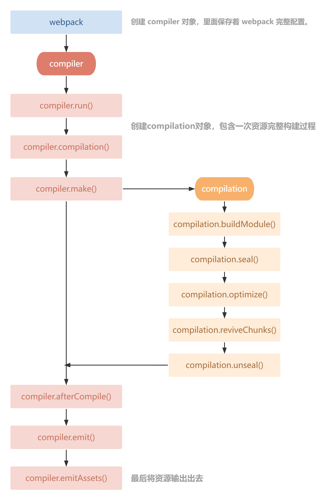

# Plugin 原理

作用：通过插件我们可以扩展 `webpack`，加入自定义的构建行为，使 `webpack` 可以执行更广泛的任务，拥有更强的构建能力。

工作原理：`webpack` 就像一条生产线，要经过一系列处理流程后才能将源文件转换成输出结果。这条生产线上的每个处理流程的职责都是单一的，多个流程之间有存在依赖关系，只有完成当前处理后才能交给下一个流程去处理。插件就像是一个插入到生产线中的一个功能，在特定的时机对生产线上的资源做处理。`webpack` 通过 `Tapable` 来组织这条复杂的生产线。`webpack` 在运行过程中会广播事件，插件只需要监听它所关心的事件，就能加入到这条生产线中，去改变生产线的运作。`webpack` 的事件流机制保证了插件的有序性，使得整个系统扩展性很好。

站在代码逻辑的角度就是：`webpack` 在编译代码过程中，会触发一系列 `Tapable` 钩子事件，插件所做的，就是找到相应的钩子，往上面挂自己的任务，也就是注册事件，这样，当 `webpack` 构建的时候，插件注册的事件就会随着钩子的触发而执行了。

## Webpack 内部的钩子

钩子的本质就是：事件。为了方便我们直接介入和控制编译过程，`webpack` 把编译过程中触发的各类关键事件封装成事件接口暴露了出来。这些接口被很形象地称做：`hooks`（钩子）。

### Tapable

`Tapable` 为 `webpack` 提供了统一的插件接口（钩子）类型定义，它是 `webpack` 的核心功能库。`webpack` 中目前有 10 种 `hooks`，在 `Tapable` 源码中可以看到，它们是：

```js
// https://github.com/webpack/tapable/blob/master/lib/index.js
exports.SyncHook = require("./SyncHook");
exports.SyncBailHook = require("./SyncBailHook");
exports.SyncWaterfallHook = require("./SyncWaterfallHook");
exports.SyncLoopHook = require("./SyncLoopHook");
exports.AsyncParallelHook = require("./AsyncParallelHook");
exports.AsyncParallelBailHook = require("./AsyncParallelBailHook");
exports.AsyncSeriesHook = require("./AsyncSeriesHook");
exports.AsyncSeriesBailHook = require("./AsyncSeriesBailHook");
exports.AsyncSeriesLoopHook = require("./AsyncSeriesLoopHook");
exports.AsyncSeriesWaterfallHook = require("./AsyncSeriesWaterfallHook");
exports.HookMap = require("./HookMap");
exports.MultiHook = require("./MultiHook");
```

`Tapable` 还统一暴露了三个方法给插件，用于注入不同类型的自定义构建行为：

- `tap`：可以注册同步钩子和异步钩子。

- `tapAsync`：回调方式注册异步钩子。

- `tapPromise`：Promise 方式注册异步钩子。

## Plugin 构建对象

### Compiler

`compiler` 对象中保存着完整的 `webpack` 环境配置，每次启动 `webpack` 构建时它都是一个独一无二，仅仅会创建一次的对象。

这个对象会在首次启动 `webpack` 时创建，我们可以通过 `compiler` 对象上访问到 `webpack` 的主环境配置，比如 loader、plugin 等等配置信息。

主要属性：

- `compiler.options`：可以访问本次启动 `webpack` 时候所有的配置文件，包括但不限于 loaders、entry、output、plugin 等等完整配置信息。

- `compiler.inputFileSystem` 和 `compiler.outputFileSystem`：可以进行文件操作，相当于 Nodejs 中 fs。

- `compiler.hooks`：可以注册 `tapable` 的不同种类 Hook，从而可以在 `compiler` 生命周期中植入不同的逻辑。

[compiler hooks 文档](https://webpack.docschina.org/api/compiler-hooks/)

### Compilation

`compilation` 对象代表一次资源的构建，`compilation` 实例能够访问所有的模块和它们的依赖。

一个 `compilation` 对象会对构建依赖图中所有模块，进行编译。在编译阶段，模块会被加载（load）、封存（seal）、优化（optimize）、分块（chunk）、哈希（hash）和重新创建（restore）。

主要属性：

- `compilation.modules`：可以访问所有模块，打包的每一个文件都是一个模块。

- `compilation.chunks`：chunk 即是多个 modules 组成而来的一个代码块。入口文件引入的资源组成一个 chunk，通过代码分割的模块又是另外的 chunk。

- `compilation.assets`：可以访问本次打包生成所有文件的结果。

- `compilatuon.hooks`：可以注册 tapable 的不同种类 Hook，用于在 `compilation` 编译模块阶段进行逻辑添加以及修改。

[compilatuon hooks 文档](https://webpack.docschina.org/api/compilation-hooks/)

### 生命周期简图



## Plugin 插件开发

`webpack` 读取配置时，会执行插件的 `constructor` 方法。

然后创建 `compiler` 对象。

遍历所有插件，调用插件的 `apply` 方法。

```js
class TestPlugin {
  constructor() {
    console.log('TestPlugin---constructor()')
  }
  apply(compiler) {
    console.log('TestPlugin---apply()')
  }
}

module.exports = TestPlugin
```

注册 `hooks`。

```js
class TestPlugin {
  constructor() {
    console.log('TestPlugin---constructor()')
  }
  apply(compiler) {
    console.log('TestPlugin---apply()')

    // 注册同步钩子（SyncHook），只能用 tap 注册
    compiler.hooks.compile.tap('TestPlugin', compilation => console.log('compiler---compile()'))

    /*
      注册异步并行钩子，特点是异步任务同时执行；
      可以使用 tap、tapAsync、tapPromise 注册；
      如果使用 tap 注册的话，进行异步操作是不会等待异步操作执行完成的。
    */
    compiler.hooks.make.tap('TestPlugin', comilation => {
      comilation.hooks.seal.tap('TestPlugin', () => console.log('comilation---seal'))
      setTimeout(() => console.log('compiler---make---111'), 1000)
    })
    compiler.hooks.make.tapAsync('TestPlugin', (comilation, callback) => {
      setTimeout(() => {
        console.log('compiler---make---222')
        callback()
      }, 2000)
    })
    compiler.hooks.make.tapPromise('TestPlugin', comilation => {
      return new Promise(resolve => {
        setTimeout(() => {
          console.log('compiler---make---333')
          resolve()
        }, 3000)
      })
    })

    // 注册异步串行钩子，特点就是异步任务顺利执行
    compiler.hooks.emit.tapAsync('TestPlugin', (compilation, callback) => {
      setTimeout(() => {
        console.log('compiler---emit---111')
        callback()
      }, 1000);
    })
    compiler.hooks.emit.tapAsync('TestPlugin', (compilation, callback) => {
      setTimeout(() => {
        console.log('compiler---emit---222')
        callback()
      }, 2000);
    })
    compiler.hooks.emit.tapAsync('TestPlugin', (compilation, callback) => {
      setTimeout(() => {
        console.log('compiler---emit---333')
        callback()
      }, 3000);
    })
  }
}
```

## Plugin 插件调试

通过调试可以很直观的查看 `compiler` 和 `compilation` 对象数据情况。

`package.json` 配置指令：

```json
{
  "scripts": {
    "debug": "node --inspect-brk ./node_modules/webpack-cli/bin/cli.js"
  }
}
```

运行指令：

```bash
npm run debug
```

此时控制台输出以下内容：

```bash
> debug
> node --inspect-brk ./node_modules/webpack-cli/bin/cli.js

Debugger listening on ws://127.0.0.1:9229/4948994d-846f-4905-85aa-d2dea790d65b
For help, see: https://nodejs.org/en/docs/inspector
```

打开 `Chrome` 浏览器，F12 打开浏览器调试控制台。

此时控制台会显示一个绿色的图标。


点击绿色的图标进入调试模式。

在需要调试代码处用 `debugger` 打断点，从而调试查看数据情况。
