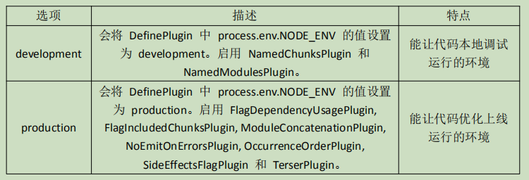

# webpack简介

`webpack` 是一种前端资源构建工具，一个静态模块打包器（module bundler）。

在 `webpack` 看来，前端的所有资源文件（js、json、css、img...）都会作为模块处理。

它将根据模块的依赖关系进行静态分析，打包生成对应的静态资源（bundle）。

**webpack 的五个核心概念**

- `entry` 入口：指示 `webpack` 以哪个文件为入口起点开始打包，分析构建内部依赖图。

- `output` 输出：指示 `webpack` 打包后的资源 `bundles` 输出到哪里去，以及如何命名。

- `loader` 加载器：让 `webpack` 能够去处理那些非 js 文件。（`webpack` 自身只理解 js）

- `plugin` 插件：可以用于执行范围更广的任务，插件的范围包括，从打包优化和压缩，一直到重新定义环境中的变量等。

- `mode` 模式：指示 `webpack` 使用相应模式的配置。  
开发模式：`development`。  
生产模式：`production`。

